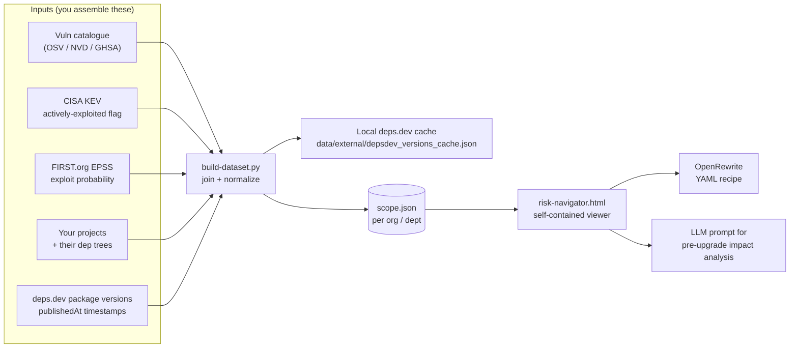
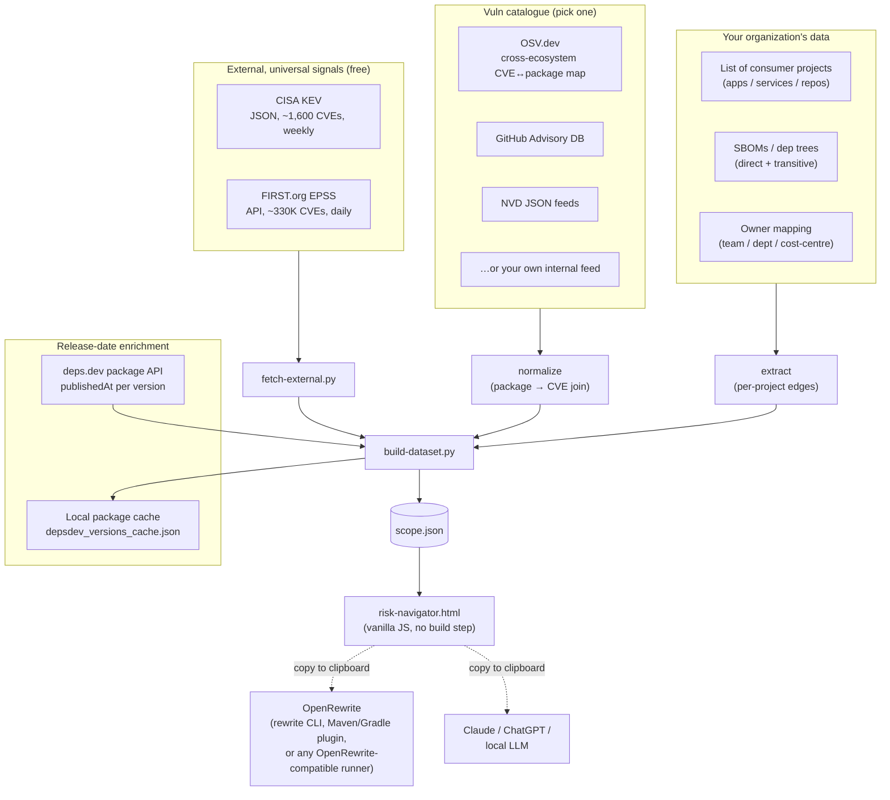
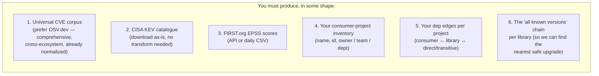
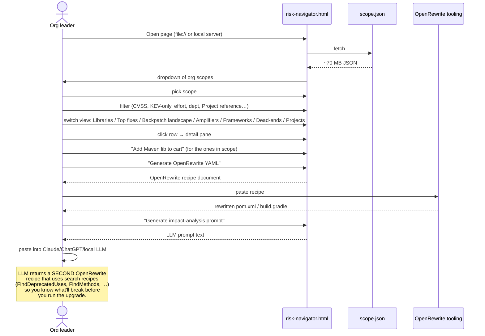

# OSERA Risk Navigator

A FINOS community project.

> A decision-enablement HTML tool for tech-org leaders, designed to be built
> against open-source vulnerability data and your organisation's own
> dependency inventory.
>
> The three files here — `README.md` (this one), `SPEC.md`, and `PROMPT.md`
> — are intentionally written to be self-contained. Hand them to a coding
> agent (Claude Code, Cursor, etc.) along with your data sources and you
> should get a working v0 in roughly a week of focused effort.

## Implementation status

This folder now includes a working implementation:

- Pipeline scripts: `scripts/`
- Static viewer: `tool/risk-navigator.html`
- Branded Docusaurus docs site: `website/`
- Sample built dataset (`OSERA Demo Data (Example)`): `data/finos-sample-platform.json`
- Optional real org built dataset: `data/finos-github-org.json` (generated locally, not checked in)
- Validation/tests: `scripts/validate_dataset.py`, `tests/`
- Architecture and data-pipeline decisions: `IMPLEMENTATION.md`
- Company customization guide: `docs/CUSTOMIZATION_GUIDE.md`
- Efficient local rebuild path:
  - derive package allowlist from scope deps (`scripts/build_package_allowlist.py`)
  - ingest only matching OSV package records (`scripts/ingest_vulns.py --package-allowlist-file ...`)
  - reuse existing ingest automatically when source/allowlist are unchanged
  - enrich CVE records in pipeline output with OSV narrative metadata (`title`, `summary`, `description`, `published`, `modified`) from local `data/vulns.db` and optional `data/external/cve_metadata.json` overlay

## Project docs

- `README.md`: project overview, architecture, runbook.
- `SPEC.md`: full data and UI contract (authoritative build spec).
- `PROMPT.md`: coding-agent bootstrap prompt for rebuild/extension.
- `docs/CUSTOMIZATION_GUIDE.md`: enterprise customization and overlay-repo model.
- `IMPLEMENTATION.md`: implementation and pipeline design decisions in this repo.

## Build and run

From the repository root:

```bash
npm install
python3 -m venv .venv
source .venv/bin/activate
python -m pip install -r requirements-dev.txt

# sample/demo dataset
npm run build:all

# local FINOS GitHub org snapshot dataset
npm run build:all:finos-org

# optimized full-OSV flow with local cache reuse
npm run build:all:finos-org:full-osv

# run tests
npm test

# start local viewer (Vite serves /tool/risk-navigator.html)
npm run dev

# build the branded docs site
npm run docs:install
npm run docs:build

# offline static serve path (no npm dev server required)
python3 -m http.server 5173
# then open http://localhost:5173/tool/risk-navigator.html

# optional: explicit dataset build with deps.dev release-date cache path
python3 scripts/build_dataset.py --scope finos-github-org \
  --raw-root data/raw \
  --external-dir data/external \
  --output-dir data \
  --vuln-db data/vulns.db \
  --cve-metadata-cache data/external/cve_metadata_cache.json \
  --depsdev-cache data/external/depsdev_versions_cache.json \
  --meta-overlay data/meta/finos-org-meta.json \
  --amplifiers-preaggregated
```

## GitHub Pages

The Docusaurus site is published by the GitHub Actions workflow in `.github/workflows/pages.yml`.
On pushes to `main`, the workflow builds `website/` with the GitHub Pages base path and deploys to:

```text
https://finos-backpatch.github.io/risk-navigator/
```

### Overlay metadata hooks

Built datasets can optionally provide UI override metadata in `meta`:

- `branding.primary.logo_url`, `branding.primary.label`
- `branding.attribution.text`, `branding.attribution.url`
- `scope_label`, `division`, `division_short`, `scope_type`
- `filter_labels.project_group`, `filter_labels.project_reference`
- `frameworks_overlay` (array) or `frameworks_overlay_url` (JSON URL)
- `namespace_icons` registry for namespace/icon override entries

These hooks are optional; the viewer keeps current defaults when omitted.

### Current UI contract (implemented)

- Branding/header: FINOS logo image + `· OSERA` with `Risk Navigator` app title.
- Filter bar:
  - `CVSS Min` slider (`0.0`-`10.0`)
  - `EPSS Min` slider (`0.000`-`1.000`)
  - effort chips, project-group (heuristic by default), namespace, project-reference chips, text search, KEV-only, direct-only
- Seven modes: Libraries, Top fixes, Backpatch landscape, Amplifiers, Frameworks, Dead-ends, Projects.
- Top fixes:
  - includes `UPGRADE_PATCH`, `UPGRADE_MINOR`, `UPGRADE_MAJOR`, `BACKPATCH_PROBABLE`, `BACKPATCH_LIKELY`, `CREATE_PATCH`, `AMPLIFIER`, `FRAMEWORK`
  - `BACKPATCH_PROBABLE`: no safe PATCH or MINOR jump exists
  - `BACKPATCH_LIKELY`: no safe PATCH jump exists but safe MINOR path exists; investigation required
  - if only a MAJOR safe path exists (minor line abandoned), classify as `BACKPATCH_PROBABLE`
  - `CREATE_PATCH`: current release is latest observed and still vulnerable; patch creation is needed rather than a classic backport
  - where release dates are available, details show release-age notes and a maintenance signal to indicate likely upstream-fix momentum vs local patch ownership need
  - table supports column sorting, including sorting by `Action` to group `BACKPATCH_*` items
- Right pane:
  - uses structured tables for version chains, project libraries, and framework member libraries (not pipe-delimited strings)
  - KEV indicators include `🔥` and links to CISA KEV catalog search
- Icons:
  - uses MIT-licensed Devicon assets
  - package-manager/namespace icon only (no duplicate language icon when package-manager icon exists)
  - GitHub project rows/details show GitHub icon and `org/repo` (omit `github/` text prefix)
- OpenRewrite Cart:
  - Maven-only add-to-cart action in library detail
  - cart entry points are hidden/disabled when Maven libraries are out of scope
  - buttons: `Generate OpenRewrite YAML`, `Impact prompt`, `Clear cart`
  - fixed docs link in cart footer: `docs.openrewrite.org`
  - warning text clarifies current focus on direct dependencies; transitive workflow is a future iteration
- In-app documentation:
  - top-right `Help` button opens a modal
  - modal renders markdown usage documentation for filters, modes, top fixes, and OpenRewrite cart workflow

---

## In one paragraph

You bring a tech-org leader (super-dept / dept owner / VP / CTO of a business
line) into a meeting. They want to know: *"What's my supply-chain CVE exposure?
Where do I get the biggest bang for the buck? Where am I stuck because no fix
exists upstream?"* Risk Navigator is a **single self-contained HTML file** that
opens against a static JSON snapshot for that owner's org and answers those
questions interactively — sortable tables, filters, simulators, and a
Maven-only "shopping cart" that emits an OpenRewrite YAML recipe to
actually apply the upgrades.

---

## What it does (30-second version)



The HTML file is the only thing your users interact with. They double-click,
the page loads `scope.json`, and they explore.

---

## Why this matters

A modern enterprise has thousands of consumer projects, each with hundreds of
dependencies (direct and transitive), and the CVE corpus changes weekly. The
question *"what should we upgrade first?"* has a defensible answer when you
weight CVEs by:

- **Severity** (CVSS) — the textbook signal.
- **Active exploitation** (CISA KEV) — the "this is happening right now" signal.
- **Exploit likelihood** (EPSS) — the probabilistic forward-looking signal.
- **Blast radius** — how many of *your* consumer projects pull the
  vulnerable library.
- **Upgrade effort** — patch vs minor vs major vs dead-end. (A 9.8 CVE
  that's a major-version jump may rank lower than a 7.5 that's a patch.)
- **Amplifier leverage** — if one parent library transitively pulls the CVE
  lib into 50 of your projects, *upgrading the parent* is a single high-ROI
  fix.
- **Framework grouping** — coordinated upgrades (e.g. "bump all of Spring")
  amortize the change-management cost.

Risk Navigator does this weighting on the client side as you filter, so the
ranking is interactive — not a static report.

---

## Architecture at a glance



The boundary is deliberate: **the universal vuln-intelligence side
(KEV / EPSS / OSV / NVD) is decoupled from your organisation's project side**.
If your organisation already has an internal dependency catalogue, you can
substitute a single extract from it for the two left-hand boxes; the
right-hand boxes (HTML viewer, OpenRewrite integration) are unchanged.
Most open-source implementers will build the left boxes from public sources
and the right boxes from their own SBOMs or build-tool extracts.

---

## What you need to assemble



### How to get each piece

| Piece | Free / open sources | Notes |
|-------|--------------------|-------|
| **1. Vuln corpus** | [osv.dev](https://osv.dev/) (Google) — `git clone github.com/google/osv.dev` and ingest the JSON files. Also covers GHSA. | OSV is the **recommended primary**. It already maps CVEs to ecosystem packages with version ranges. |
| | NVD JSON feeds — [nvd.nist.gov](https://nvd.nist.gov/vuln/data-feeds) | Fine as supplement for CVSS/CWE detail. |
| | GitHub Advisory DB — `github/advisory-database` repo | Subset of OSV, useful for narrative descriptions. |
| **2. KEV** | [cisa.gov/known-exploited-vulnerabilities-catalog](https://www.cisa.gov/known-exploited-vulnerabilities-catalog) JSON | Direct download. ~1,600 entries. Weekly cadence. |
| **3. EPSS** | [first.org/epss](https://www.first.org/epss/api) — API + daily CSV | API supports comma-separated `cve=` filter so you only pull the ~few-thousand CVEs you actually need. |
| **4. Projects** | Your CMDB / Backstage / Cortex / inventory of record | If you don't have one, a YAML / CSV of `{id, name, team}` is enough. |
| **5. Dep edges** | SBOMs ([CycloneDX](https://cyclonedx.org/) / [SPDX](https://spdx.dev/)), or your build system: `mvn dependency:tree -DoutputType=json`, `gradle dependencies`, `npm ls --json`, `pipdeptree --json`. Tools: [Syft](https://github.com/anchore/syft) generates SBOMs from many ecosystem inputs. | Direct vs transitive flag is **critical** for the cart workflow — keep that distinction. |
| **6. Version chains** | For each `(ecosystem, package)` that appears as a dep, enumerate all known versions and join to OSV to determine which are CVE-bearing. | Maven Central / npm registry / PyPI / etc. all expose package metadata APIs. OSV's per-package endpoint gives you a complete CVE list keyed by version range. |
| **7. Release timestamps** | Enrich package version timelines from deps.dev (`publishedAt`) and cache per package locally. | Query once per package and store the full version list. Refresh only when a newer observed version appears in scope. |

---

## What you'll build

Three Python / shell scripts + one HTML page. Roughly:

```
risk-navigator/
├── scripts/
│   ├── ingest_vulns.py          # OSV/NVD → normalized internal vuln table
│   ├── fetch_external.py        # CISA KEV + FIRST.org EPSS → small JSONs
│   ├── extract_org.py           # your projects + dep trees → 6 raw CSVs
│   └── build_dataset.py         # joins everything + deps.dev release-date enrichment → scope.json
├── tool/
│   ├── risk-navigator.html      # the viewer (vanilla JS, no build step)
│   └── manifest.json            # lists available scope.json files
└── data/
    ├── local/                   # local-only caches (gitignored): full OSV all.zip + metadata
    ├── external/                # kev.json, epss.json, depsdev_versions_cache.json
    ├── raw/<slug>/              # 6 CSVs per scope (audit-friendly)
    └── <slug>.json              # built dataset(s)
```

The HTML is **stateless** — open it in any browser, point it at a JSON. No
server, no build step, no framework. ~70 KB self-contained.

Data policy:
- Keep sample artifacts (`OSERA Demo Data (Example)`, file slug `finos-sample-platform`) in-repo for distribution.
- Keep full OSV dump + live rebuilt org datasets local (gitignored) and regenerate as needed.
- Keep deps.dev version-date cache local (gitignored); refresh a package only when a newer observed version appears in the raw scope.

---

## What it looks like in use



---

## Headline features (each detailed in SPEC.md)

| Feature | What it does |
|---------|--------------|
| **Seven table modes** | Libraries · Top fixes · Backpatch landscape · Amplifiers · Frameworks · Dead-ends · Projects. One toggle, all share the same filter bar. |
| **Effort classification** | PATCH / MINOR / MAJOR / DEAD_END / UNKNOWN, computed from the nearest GA-only safe version in the library's version chain. |
| **Top fixes** | Unified ranked action list — direct upgrade, amplifier upgrade, framework upgrade, and remediation opportunities (`BACKPATCH_PROBABLE` / `BACKPATCH_LIKELY` / `CREATE_PATCH`). Score weighted by consumer impact × CVE count / effort, with multipliers for KEV + EPSS. |
| **What-if simulators** | Per-library (assume a backport patch exists), per-amplifier (assume new parent version pulls safe lib), per-framework (coordinated upgrade). Shows CVE relief + effort downgrade per impacted lib. |
| **Direct vs transitive** | Surfaced at every level — filter chip, grid column, impact banner in the lib detail, DIR/TRA badges on each listed consumer project, warnings in the cart. |
| **Project reference / project-group filter** | Datalist typeahead + exact-match chips for multi-select. Default grouping is heuristic (project-name token based); companies can map to true org departments/BU structures via customization. |
| **Maven OpenRewrite cart** | Add libs → edit FROM/TO ranges → generate an OpenRewrite YAML recipe (uses `org.openrewrite.java.dependencies.UpgradeDependencyVersion` which handles both Maven and Gradle). |
| **LLM impact-analysis prompt** | Cart also generates a Claude/ChatGPT-ready prompt asking the model to identify deprecated APIs between FROM and TO versions and return a SECOND OpenRewrite recipe — using `FindDeprecatedUses`, `FindMethods`, `FindFields`, `FindTypes` — so you find consumers of the about-to-break APIs in your codebase before the upgrade lands. |
| **Light / dark theme** | One token block in CSS. `prefers-color-scheme` on first load, `localStorage` after. |
| **Multi-dataset** | `manifest.json` lists available scopes; the dropdown picker switches between them with an in-memory cache so back-and-forth is instant. |
| **Persistent cart** | Per-scope cart stored in `localStorage`. Survives refresh. |

---

## How to use this repo as a starting point

You're an outside implementer reading this. Here's the path I'd suggest:

1. **Read `SPEC.md`** in this folder — it's the build instructions.
2. **Pick a vuln data source.** OSV.dev is the simplest comprehensive option.
3. **Pick a way to enumerate your projects and their dep trees.** SBOMs are
   the cleanest input; build-tool extracts work too.
4. **Drop both files into Claude Code / Cursor / your coding agent of choice**
   along with sample data. Ask it to scaffold the four scripts and the HTML.
5. **Iterate.** The HTML is the reference UX; the scripts will need tuning to
   your data shapes.
6. **(Optional)** Wire CI to refresh the dataset on a schedule.

### Assumptions an implementer is taking on

- **You have a stable identifier for each consumer project.** Anything works
  (repo URL, internal project ID, slug) but it must be unique and persistent.
- **You can enumerate each project's dep tree at a known point in time.** Most
  build tools can. SBOM generators can. If you can't, the Projects view and
  the "blast radius" weighting won't be meaningful.
- **You can record direct vs transitive per edge.** Critical for the cart
  workflow — OpenRewrite's `UpgradeDependencyVersion` only rewrites direct
  deps. SBOMs in CycloneDX with `dependencies` graph give you this; Maven
  `dependency:tree` gives you this.
- **Your dep coords map to the public vuln catalogue's coords.** If you
  internally repackage open-source libs (e.g. shaded JARs, vendor forks),
  you'll need a mapping table. The
  [Package URL (purl) spec](https://github.com/package-url/purl-spec) is
  the de-facto bridge — most public catalogues (OSV, GHSA) emit purls and
  most SBOM generators emit them as well.
- **You're OK with an HTML file as the delivery vehicle.** No SSO, no server,
  no audit log. The dataset *is* the security surface; protect it like a
  spreadsheet that you'd otherwise email around.

### What you do NOT need

- A vector database / RAG stack. The tool is purely structural — interactive
  filtering on a JSON dataset.
- An LLM for the day-to-day use case. The LLM only shows up in the
  *impact-analysis prompt* feature, which gives the user a text prompt to
  paste elsewhere; the HTML doesn't call an LLM directly.
- A graph database. The amplifier / framework / project-reverse-index
  computations are small enough to do in-memory at build time.
- Authentication. Add it if you need it, but the tool is designed to be
  shareable as a static file.

---

## Provenance & licensing notes

Recommended data sources and their licensing:

- **CISA KEV catalogue** — U.S. government work, public-domain.
- **FIRST.org EPSS** — free for non-commercial and commercial use,
  attribution appreciated.
- **OSV.dev / GitHub Advisory DB** — CC-BY-4.0.
- **NVD feeds** — public-domain.
- **Your organisation's dependency data** — whatever your internal license
  / data-handling rules say. Treat the built `data/<scope>.json` like any
  other sensitive engineering metadata.

The HTML tool itself is intentionally framework-free (vanilla JS) so there's
no upstream JS dependency tree to vet. CSS variables and `<datalist>` /
`<details>` are the only modern-browser features required.

---

## Roadmap (open-ended)

- An OSV → internal-shape ingestion script as a reference adapter.
- A Syft-based SBOM ingestion script for the project-side input.
- An `UpgradeTransitiveDependencyVersion` cart variant for Maven managed
  dependencies.
- A built-in time-machine (`--as-of <date>`) so the dataset can answer
  "how did our exposure look 3 months ago?".
- An *"all our orgs"* roll-up view for executive overviews.

See `SPEC.md` § Future Requirements for the full backlog.
