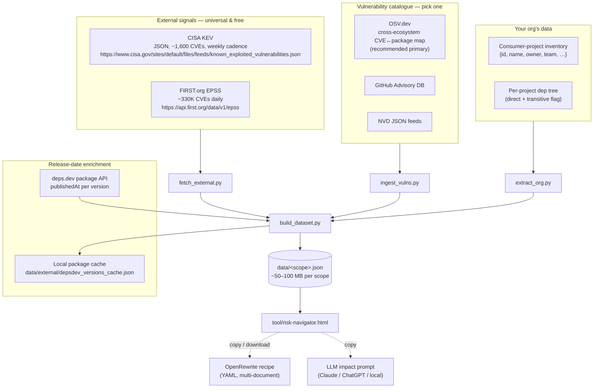
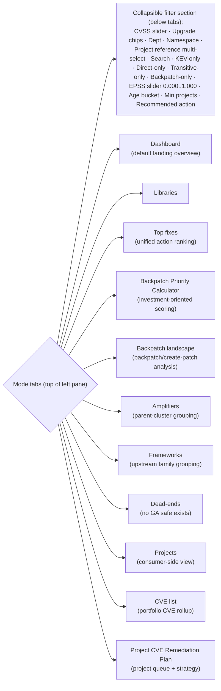
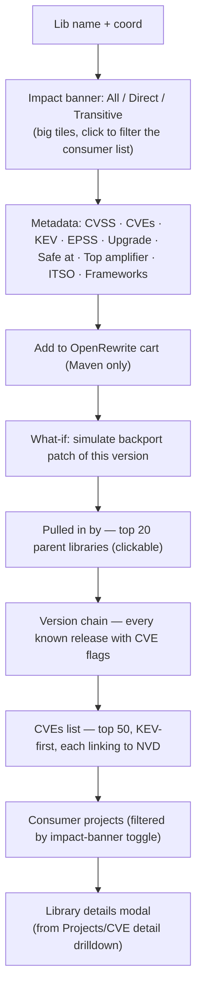

# Risk Navigator — open-source build spec

> **Audience**: a developer (or AI coding agent) building a generic version of
> the tool against open-source vuln data. Reading this top-to-bottom should be
> enough to produce a working v0 in roughly a week of focused effort.
>
> **Companion to** `README.md` in this folder. Start there for the *why*; come
> here for the *how*.

---

## 0. Prerequisites

The reference implementation assumes:

- Node.js 20 or later.
- npm 10 or later.
- Python 3.11 or later.
- Git for optional public repository scans.
- Network access when fetching OSV, CISA KEV, FIRST EPSS, deps.dev, or public GitHub repository data.
- Optional SBOM scanner tooling when regenerating scanner-based demo inputs:
  - `cdxgen`, or
  - `syft`.

The static viewer itself has no runtime server dependency. Once a dataset has
been built, `tool/risk-navigator.html` can be served by any static-file server.

Do not document local workstation paths, usernames, shell initialization details,
or machine-specific package-manager setup in project docs or published demo
metadata. Public docs and sample datasets should use portable commands and
repo-relative paths.

## 1. Goals

Build a **static, self-contained HTML viewer** plus a **set of ingestion
scripts** that together let a tech-org leader answer, in a 1-hour meeting:

1. *"What's my CVE exposure surface, ranked by what hurts most?"*
2. *"Which ones are easy to fix and which are stuck?"*
3. *"If I bumped this one amplifier or framework, what would clear?"*
4. *"Which CVEs am I trying to focus on / hide?"*
5. *"What if I backported a patch for library L?"*

The tool is **read-only and reflective**. It doesn't assign tickets, record
decisions, or talk to JIRA. After the meeting the owner files the work in
their normal pipeline.

Positioning statement:

> This is not merely a vulnerability list. It is an
> investment-prioritization and remediation-orchestration engine for
> mutualized open-source maintenance.

### 1.1 Implementation alignment (current repo)

The implementation in this repository keeps the core contract in this SPEC,
with these concrete UI/UX choices now treated as requirements:

- Top branding uses FINOS identity (`FINOS | OSERA`) with Risk Navigator title.
- EPSS filter is a slider in `[0.000, 1.000]` (not free-form numeric text).
- Top fixes table is column-sortable, including sort by `Action`.
- BACKPATCH is qualified and surfaced as:
  - `BACKPATCH_PROBABLE`: no safe PATCH or MINOR jump exists in snapshot
  - `BACKPATCH_LIKELY`: no safe PATCH jump exists but safe MINOR jump exists
- `CREATE_PATCH` is surfaced when current release is the latest observed release and still vulnerable (patch creation, not backport).
- If only a MAJOR safe path exists (minor line abandoned), classify as `BACKPATCH_PROBABLE`.
- Detail panes use structured tabular layouts for version chains, framework members, and project libraries (not pipe-delimited strings).
- Namespace visuals use package-manager icons (Devicon, MIT licensed); avoid duplicate language icons when package-manager icon exists.
- GitHub project references are displayed as icon + `org/repo` (textual `github/` prefix omitted in grid/detail displays).
- Cart copy uses `OpenRewrite Cart` and `Generate OpenRewrite YAML`.
- A top-right `Help` control opens an in-app markdown documentation modal that explains usage of filters, modes, scoring/actions, and cart workflow.
- Help modal includes tab-style navigation (`How to use`, `Glossary/About`) and uses the same visual button language as main mode tabs.
- Help modal tab strip remains sticky while modal content scrolls.
- Main mode tabs remain sticky at the top of the left pane during table scroll.
- Active mode tabs use a high-contrast, dark primary-filled style (cart-button prominence level) to make selection state obvious.
- Header scope pills include a unique-CVE count next to project count.
- Right-hand detail pane width is user-adjustable via a draggable divider between left/right panes and persisted locally.
- Viewer session preferences persist locally across reloads, including last selected dataset and last active mode/tab (query params still override when provided).
- Amplifier/framework member library sets in right-side details use structured tables (not plain string lists).
- Dashboard is the default landing mode and summarizes current-filter exposure:
  affected projects, distinct CVEs, vulnerable libraries, KEV counts,
  namespace spread, CVSS spread, project-group spread, and direct/transitive
  opportunity mix. It also presents an executive opportunity landscape across
  remediation lanes: direct upgrades, coordinated leverage, OSERA patch work,
  and major migrations.
- When a table row selection changes, the right-hand detail pane scroll position
  resets to the top of that pane.

---

## 2. Non-goals

- **Not a remediation tracking system.**
- **Not a real-time view.** It's a static snapshot for a specific meeting;
  re-run the ingestion to refresh.
- **Not a CVE database.** It surfaces the *actionable* subset of CVE
  information.
- **Not a server.** No auth, no audit log, no API; the dataset *is* the
  security surface — protect it like a sensitive spreadsheet.
- **Not a vector / RAG stack.** Purely structural — interactive filtering on a
  JSON dataset. An LLM only appears in the *impact-analysis prompt* feature,
  and even there the HTML doesn't call an LLM directly; it generates text the
  user pastes elsewhere.

---

## 3. Architecture



Four scripts, one HTML, one or more JSONs. No build step. No server. The HTML
opens via `file://` or any static-file server.

### 3.1 Dataset production contract

Every published dataset should be reproducible from documented inputs:

- list the dataset in `tool/manifest.json`,
- document the source inventory path,
- document the build command,
- document the validation command,
- preserve enough raw extract files or SBOM inputs to audit how the final JSON
  was produced,
- avoid machine-local absolute paths in final JSON metadata.

Manifest entries require `label` and `url`. They may also include
`description`, `source_type`, `coverage`, `limitations`, and `docs_url`; the
viewer must use those fields, together with `data/<scope>.json`
`meta.dataset_methodology`, to explain the active dataset in Help/About.

For the bundled samples:

- `data/finos-sample-platform.json` is produced from the synthetic extractor and
  raw CSVs under `data/raw/finos-sample-platform/`.
- `data/finos-sbom-demo.json` is produced from CycloneDX SBOM files under
  `data/sboms/finos-sbom-demo/`, then normalized to raw CSVs under
  `data/raw/finos-sbom-demo/`.
- `data/finos-deep-sbom-demo.json` is produced from deterministic curated
  CycloneDX SBOM files under `data/sboms/finos-deep-sbom-demo/`, generated by
  `scripts/generate_deep_sbom_demo.py`, then normalized to raw CSVs under
  `data/raw/finos-deep-sbom-demo/`. This sample intentionally preserves
  direct/transitive dependency graphs across Maven/Gradle-style Java, npm,
  PyPI, OCI base-image, and RPM child-package examples.
- `data/finos-github-org.json` is the broad public FINOS org snapshot. It is
  useful for portfolio coverage, but manifest extraction is often direct-only;
  use a lockfile/SBOM/scanner graph when direct/transitive fidelity is required.

---

## 4. Data model — the schema you'll join into

This SPEC is the source of truth for the dataset shape; the viewer and
validator implement this contract. Match it exactly or the UI won't render.
Every other concern (ingestion, normalization, storage) can vary by
implementation.

### 4.1 The built dataset (`data/<scope>.json`)

One JSON per "scope" — a meaningful slice of your org. A scope is whatever
unit your leadership reviews in one meeting: a department, a business line,
a system family, a region. Keep them roughly 1k–200k consumer projects each.

```jsonc
{
  "meta": {
    "scope_type": "department",                   // your own terminology
    "scope_name": "Platform Engineering",
    "scope_label": "Platform Engineering (PE)",   // optional display override
    "division": "Enterprise Technology",          // optional
    "division_short": "ET",                       // optional
    "extracted_at": "2026-05-17T03:00:00Z",
    "filters_applied": {
      "tooling_qualifiers_excluded": ["test", "build", "module-load"],
      "cvss_min": 0.01
    },
    "external_signals": {
      "kev_loaded": true,
      "epss_loaded": true,
      "fetched_at": "2026-05-17T02:55:00Z",
      "kev_total_entries": 1592,
      "epss_total_entries": 332014,
      "cve_metadata": {
        "overlay_loaded": true,
        "overlay_entries": 410,
        "db_loaded": true,
        "db_entries": 101233
      },
      "release_enrichment": {
        "enabled": true,
        "packages_considered": 4087,
        "packages_reused_cache": 4000,
        "packages_fetched": 87,
        "packages_failed": 0,
        "timestamps_applied": 125443
      }
    },
    "counts": {
      "consumer_projects": 4691,
      "distinct_cve_libraries": 4087,
      "distinct_amplifier_clusters": 804,
      "kev_listed_libraries": 95,
      "effort_class_distribution": { "PATCH": 1776, "MINOR": 1272, "MAJOR": 692, "DEAD_END": 347 }
    }
  },

  "departments": [                                 // for the dept-filter dropdown
    { "name": "Trading Systems", "project_count": 883 }
  ],

  "consumer_projects": [
    {
      "id": "maven|com.example.app|api-svc",      // unique stable id
      "namespace": "maven",                        // ecosystem
      "meta": "com.example.app",                   // groupId equivalent
      "proj": "api-svc",                           // artifactId equivalent
      "release": "2.7.4",                          // version currently consumed
      "project_ref": "github/example-org/api-svc",                 // optional repo identifier
      "aliases": ["api-svc", "owner-code-123"],   // optional search aliases for Project Reference chips
      "eonid": "12345",                            // optional owner-system id
      "department": "Trading Systems",
      "tai_system": "ExampleAPI"                   // optional TAI / app name
    }
  ],

  "libraries": [
    {
      "id": "maven|org.springframework|spring-web|5.3.39",
      "namespace": "maven",
      "meta": "org.springframework",
      "proj": "spring-web",
      "release": "5.3.39",
      "release_date": "2024-07-11T10:22:19Z",      // from deps.dev cache when available

      // CVE rollup for THIS specific version
      "max_cvss": 9.8,
      "cve_count": 2,
      "highest_priority": "P1",
      "max_exploitability": "FUNCTIONAL",

      // Per-CVE detail (top 50 — KEV first → EPSS desc → CVSS desc)
      "cves": [
        {
          "cve_id": "CVE-2024-XXXX",
          "cvss": 9.8,
          "exploit": "FUNCTIONAL",
          "priority": "P1",
          "kev": true,                             // KEV flag
          "epss": 0.972,                           // EPSS prob
          "epss_pctile": 0.998,                    // EPSS percentile
          "title": "Spring Framework reflected XSS",
          "summary": "Spring Framework reflected XSS in DataBinder case handling",
          "description": "Long-form advisory details if available from source",
          "published": "2024-10-17T00:00:00Z",
          "modified": "2024-10-24T00:00:00Z",
          "cve_source": "osv"                      // osv | external-overlay | unknown
        }
      ],
      "cves_truncated": false,

      // Aggregated KEV / EPSS rollups for the lib
      "is_kev_listed": true,
      "kev_cve_count": 1,
      "kev_cve_ids": ["CVE-2024-XXXX"],
      "epss_max": 0.972,
      "epss_avg": 0.486,
      "epss_count": 2,

      // Library-owner metadata (the ITSO / maintainer)
      "library_itso": {
        "tai_system": "ossjava",
        "primary_owner": "team@example.com",
        "department": "OSS Maintenance"
      },

      // Consumer projects: who in YOUR org depends on this lib
      "consumer_project_ids": ["maven|com.example.app|api-svc", "..."],   // union, capped at 200
      "consumer_project_ids_truncated": false,
      "direct_consumer_project_ids": ["maven|com.example.app|api-svc"],   // SUBSET — direct edges only
      "direct_consumer_count": 14,
      "transitive_consumer_count": 78,
      "total_consumer_count": 88,
      "transitive_heaviness_ratio": 0.886,

      // Amplifier — the most-impactful parent that pulls this lib in transitively
      "top_amplifier": {
        "namespace": "maven",
        "meta": "org.springframework.security",
        "proj": "spring-security-web",
        "release": "5.8.16",
        "amplifier_consumer_count": 65
      },
      "all_amplifiers": [ /* top 20 of the above */ ],
      "all_amplifiers_truncated": false,

      // Version chain — every known release of (namespace,meta,proj), oldest→newest
      "version_chain": [
        { "release": "5.3.31", "release_id": 19785367, "max_cvss": 9.8, "cve_count": 6, "is_safe": false, "release_date": "2024-03-14T09:12:05Z", "release_date_source": "deps.dev" },
        { "release": "5.3.39", "release_id": 44040872, "max_cvss": 9.8, "cve_count": 2, "is_safe": false, "release_date": "2024-07-11T10:22:19Z", "release_date_source": "deps.dev" },
        { "release": "6.0.0",  "release_id": 50000000, "max_cvss": 5.3, "cve_count": 1, "is_safe": true,  "release_date": "2022-11-16T07:57:50Z", "release_date_source": "deps.dev" },
        { "release": "6.0.23", "release_id": 50000023, "max_cvss": 5.3, "cve_count": 1, "is_safe": true,  "release_date": "2024-06-13T09:44:08Z", "release_date_source": "deps.dev" }
      ],
      "nearest_safe_version": "6.0.0",             // min-distance GA safe (see §5.1)
      "max_safe_patch_same_minor": "6.0.23",       // max GA patch in same minor as chosen safe
      "distance_to_safe": "MAJOR",                 // PATCH / MINOR / MAJOR / DEAD_END / UNKNOWN
      "effort_class": "MAJOR"
    }
  ],

  "amplifier_clusters": [
    {
      "amplifier_id": "maven|org.springframework.boot|spring-boot-starter",
      "amplifier_label": "maven/org.springframework.boot/spring-boot-starter",
      "amplified_libraries": ["maven|org.yaml|snakeyaml|1.30", "..."],
      "consumer_project_count_affected": 234,
      "cve_count_total": 89
    }
  ]
}
```

Version normalization rules:

- `library.id`, `library.release`, and every `version_chain[].release` must use
  the package-manager canonical version, not a Git tag decoration.
- For `pypi` and `npm`, a leading `v` or `V` immediately before a digit is
  treated as tag syntax and stripped. For example, `v0.8.8` and `0.8.8` are the
  same release and must be represented as `0.8.8`.
- Producers must deduplicate version-chain rows after canonicalization. When
  duplicate rows collapse to the same release, keep one row using the minimum
  `release_id`, maximum `max_cvss`, maximum `cve_count`, and any available
  release timestamp metadata.
- CVE/version edge joins and consumed-release joins must use the same
  canonical release key, so a row cannot appear once as safe `0.8.8` and again
  as unknown or vulnerable `v0.8.8`.

Optional UI overlay hooks in `meta`:

- `branding.primary.logo_url`, `branding.primary.label`
- `branding.attribution.text`, `branding.attribution.url`
- `filter_labels.project_group`, `filter_labels.project_reference`
- `frameworks_overlay` (array of rule objects) and/or `frameworks_overlay_url` (JSON URL returning array)
- `namespace_icons` registry overrides, including optional `srcOverride` for custom local SVG paths
- `namespace_icons[*].meta_patterns[]` optional meta-aware icon routing rules (`contains`, `starts_with`, `equals`, `regex`) so one namespace can render different icons by package family metadata

### 4.2 External signals (`data/external/`)

```jsonc
// kev.json — verbatim from CISA, transposed to a CVE-keyed map
{
  "fetched_at": "2026-05-17T02:55:00Z",
  "data": {
    "CVE-2024-XXXX": {
      "vendor": "Spring",
      "product": "Framework",
      "vulnerability_name": "...",
      "date_added": "2024-XX-XX",
      "short_description": "...",
      "required_action": "...",
      "due_date": "2024-XX-XX",
      "known_ransomware_use": "Unknown"
    }
  }
}

// epss.json — only CVEs you actually need (the union across your scopes)
{
  "fetched_at": "2026-05-17T02:55:00Z",
  "data": {
    "CVE-2024-XXXX": {
      "epss": 0.972,
      "percentile": 0.998,
      "date": "2026-05-17"
    }
  }
}

// cve_metadata.json — optional local overlay for CVE narrative fields
// (merged first, then backfilled from vuln_records in data/vulns.db)
{
  "fetched_at": "2026-05-17T02:55:00Z",
  "data": {
    "CVE-2024-XXXX": {
      "title": "Human-readable CVE title",
      "summary": "Short summary shown in CVE table/detail panes",
      "description": "Long-form description (optional)",
      "published": "2024-10-17T00:00:00Z",
      "modified": "2024-10-24T00:00:00Z",
      "source": "external-overlay"
    }
  }
}
```

### 4.3 Raw extracts (`data/raw/<scope>/`)

CSV-based for ergonomics. Six files per scope:

| File | Columns |
|------|---------|
| `01-consumer-projects.csv` | `id, namespace, meta, proj, release, project_ref, aliases, eonid, department, tai_system` (`aliases` optional; JSON array string or `|`-delimited string) |
| `02-dep-edges.csv` | `consumer_id, library_id, direct (0/1), qualifier` |
| `03-cve-libs.csv` | `library_id, namespace, meta, proj, release, max_cvss, cve_count, highest_priority, max_exploitability, lib_tai_system, lib_primary_owner, lib_dept` |
| `04-version-chain.csv` | `library_id, namespace, meta, proj, release, max_cvss, cve_count` (for **all** releases of `(namespace,meta,proj)` that appear in `03`) |
| `05-amplifiers.csv` | `cve_lib_id, cve_lib_coords, amplifier_id, amplifier_coords, root_projects_affected` |
| `06-cve-edges.csv` | `library_id, cve_id, cvss_base, cvss_temporal, priority, exploitability` |

These are deliberately structured to be auditable in Excel / a notebook —
keep them committed alongside the built JSON.

---

## 5. Computational rules

### 5.1 Threshold-qualified version walker (`find_nearest_safe`)

Given a current vulnerable release `R_cur` and the library's full version
chain, find the nearest **GA release** whose `max_cvss` is below the policy
CVSS threshold and whose version is strictly greater than `R_cur`. The default
pipeline threshold is `7.0`, so existing dataset fields named
`nearest_safe_version`, `max_safe_patch_same_minor`, and `is_safe` mean
"nearest/best GA release below the default policy threshold," not "no known
CVEs."

```python
_GA_SUFFIX_RE   = re.compile(r"(?:\.|-)(Final|RELEASE|GA|jre\d*)$", re.IGNORECASE)
_NUMERIC_VER_RE = re.compile(r"^\d+(?:\.\d+)*$")

def is_ga_release(s):
    """Strip a single known GA-marker tail; require the remainder to be
    pure dotted-numeric. Excludes vendor rebuilds (-atlassian-*, -cloudera-*,
    -PPA), pre-releases (-M*, -RC*, -alpha, -beta), snapshots (-SNAPSHOT),
    and milestone-marker variants (-m01)."""
    base = _GA_SUFFIX_RE.sub("", s.strip())
    return bool(_NUMERIC_VER_RE.match(base))
```

**Why GA-only matters.** Vendor-suffixed and pre-release builds often have
incomplete CVE coverage in public catalogues (CPE matching misses
vendor-tagged coordinates), so they trivially pass any CVSS threshold —
but they're the *same code* as the current release. Recommending them is a
false-positive. Skip them as upgrade targets.

Distance classification, from current to chosen:

| Comparison | Distance | Effort |
|------------|----------|--------|
| Same `major.minor`, different `patch` | PATCH | LOW (rename to **PATCH**) |
| Same `major`, different `minor` | MINOR | MEDIUM (rename to **MINOR**) |
| Different `major` | MAJOR | HIGH (rename to **MAJOR**) |
| No GA below-threshold version exists | DEAD_END | DEAD_END |
| Version string un-parseable | UNKNOWN | UNKNOWN |

The UI displays them as **Patch / Minor / Major / Dead-end / Unknown** with
color-coding (green / yellow / orange / purple / grey).

Also record `max_safe_patch_same_minor`: of all GA candidates sharing the
chosen below-threshold target's `(major, minor)`, the highest. Used by the cart's
"Target maximum patch in same minor" toggle so the user can pin to
`6.0.23` instead of `6.0.0`.

The UI may expose a different live policy threshold for exploration. When it
does, visible version-chain status labels and displayed remediation target
candidates should recompute from the version chain client-side using the active
threshold, while the persisted dataset fields remain the default-threshold
baseline.

### 5.2 Tooling filter

Most ecosystems mark dependencies with a qualifier (Maven `scope`, npm
`devDependencies`, etc.). Strip the **tooling** ones from the dataset by
default — they don't ship to prod:

- `test` — JUnit, Mockito, Karma, Jest, xmlunit
- `build` — Gradle plugins, annotation processors
- `module-load` — anything purely loaded at build time

Make this filter visible in the JSON `meta.filters_applied` so the analyst
can see it was applied. Don't drop these libs from the *catalogue* — drop
them from the *org's dep graph* before counting consumer impact.

### 5.3 Risk signal (default ranking)

For library `L`:

```
risk_signal(L) = max_cvss(L) × ln(total_consumer_count(L) + 1)
```

That's the table's default sort. KEV multiplies by ×3; EPSS contributes a
`(1 + epss_max)` multiplier. The Top Fixes ranking uses a slightly different
formula (see §6.2).

### 5.4 Amplifier clustering

For each CVE library, derive the most-impactful parent that pulls it in
transitively. Cluster amplifiers across releases — `spring-boot-starter
2.6.x` and `2.7.x` collapse to a single `spring-boot-starter` cluster.

```
top_amplifier(L) = argmax over parents P of count(distinct consumer projects
                                                   that get L via P)
```

### 5.5 Framework clustering

Hardcode a list of framework rules in the HTML — easy to edit:

```js
const FRAMEWORKS = [
  { id: "spring-boot",     label: "Spring Boot",
    match: L => L.namespace === "maven" && /^org\.springframework\.boot(\.|$)/.test(L.meta) },
  { id: "spring-security", label: "Spring Security",
    match: L => L.namespace === "maven" && /^org\.springframework\.security(\.|$)/.test(L.meta) },
  // ...
  { id: "rhel-base", label: "RHEL base-image RPMs",
    match: L => L.namespace === "rpm" },
];
```

A library can belong to multiple frameworks (overlapping umbrellas allowed —
e.g. `spring-boot` and "Spring (all sub-projects)").

---

## 6. Views — eleven modes sharing one filter bar



### 6.1 Dashboard (default)

The default landing mode is a dashboard summary over the active dataset and
current filters. It must provide at least:

- affected project count,
- distinct CVE count,
- vulnerable library count,
- KEV-linked CVE/library counts,
- namespace spread across ecosystems such as `maven`, `npm`, `pypi`, `rpm`,
  and other observed package namespaces,
- CVSS score distribution,
- project-group distribution,
- direct versus transitive remediation opportunity counts.

Dashboard visualizations should be compact, filter-aware, and scannable. They
are for portfolio orientation; detailed investigation still happens in the
table modes and right-hand detail pane.

The dashboard must orient a decision maker toward opportunity allocation, not
just inventory counts. It should distinguish normal owner upgrades from
coordinated leverage actions, OSERA patch/backpatch candidates, and major
migrations that require explicit funding or sequencing.

In Dashboard mode, the right-hand panel is a filter sidebar, not a detail pane.
The full filter set should remain available there so decision makers can shape
the opportunity landscape while keeping the main canvas focused on the
dashboard. In table modes, the same filters return below the mode tabs and the
right-hand panel returns to row details.

### 6.2 Libraries

Columns: # · Library coord · Version · CVSS · CVEs · KEV (🔥 badge) · EPSS ·
Projects · Direct · Upgrade · Safe at · Max patch · Top amplifier.

Sortable, all of them. Click a row → detail pane.

Backpatch simulation expectation in detail pane:

- `Simulate backport patch` should show a structured impact summary, including:
  - CVEs/KEV findings addressed,
  - direct/transitive project counts benefiting,
  - baseline upgrade effort vs simulated PATCH effort,
  - projects that could avoid larger immediate upgrade motion when backpatch is available.
- This simulation is a planning heuristic and should be labeled with clear assumptions.

### 6.3 Top fixes

Unified ranked list of **action items** across the dataset. Action types and
their effort weights:

| Type | What it represents | Effort weight |
|------|--------------------|---------------|
| `UPGRADE_PATCH` | direct lib upgrade, patch-level (X.Y.Z → X.Y.Z′) | 1.0 |
| `UPGRADE_MINOR` | direct lib upgrade, minor (X.Y → X.Y′) | 2.0 |
| `UPGRADE_MAJOR` | direct lib upgrade, major (X → X′) | 4.0 |
| `BACKPATCH_PROBABLE` | no safe PATCH/MINOR jump exists; backpatch is primary remediation path | 6.0 |
| `BACKPATCH_LIKELY` | no safe PATCH jump exists, but safe MINOR jump exists; investigate backpatch vs upgrade | 6.0 |
| `CREATE_PATCH` | current release is latest observed and still vulnerable; create/maintain downstream patch | 5.5 |
| `AMPLIFIER` | upgrade an amplifier-parent | 3.0 |
| `FRAMEWORK` | coordinated upgrade across a framework family | 4.0 |

```
score = consumers_affected × (1 + cves_cleared / 10) / effort_weight
        × (kev ? 3 : 1)                                    // KEV multiplier
        × (1 + epss_max)                                   // EPSS bonus
```

Use `simulatePatchLib()`, `simulatePatchAmp()`, `simulatePatchFramework()`
to pre-compute the relief (CVEs cleared, libs downgraded, consumers
relieved) for each candidate action. Display: action, target, projects,
CVEs cleared, libs cleared, effort, score.

In the implemented UI, this table is sortable by any column, and Action-sort
is a primary workflow to quickly group `BACKPATCH_*` opportunities.

Implemented extension: for libraries whose upgrade class is `MINOR` or
`MAJOR`, an additional backpatch candidate row is emitted and qualified as
`BACKPATCH_LIKELY` or `BACKPATCH_PROBABLE` using snapshot safe-path visibility.

### 6.3 Backpatch Priority Calculator

Action-oriented ranking for OSERA patch investment decisions.

Core model:

```
Patch Candidate Score =
  25% remediation difficulty
+ 20% version / branch age
+ 15% project overlap
+ 15% enterprise upgrade risk
+ 10% security severity
+ 10% transitive amplifier impact
+ 5% upstream health / support signal
```

Component assumptions in the current implementation:

- remediation difficulty: derived from `effort_class` (`PATCH` low → `DEAD_END` high)
- version/branch age: derived from release timestamp if present; otherwise `Unknown` bucket
- project overlap: normalized affected-project count
- enterprise upgrade risk: weighted by effort class + transitive exposure + major-only path signal
- security severity: derived from `max_cvss` plus KEV boost
- transitive amplifier impact: derived from transitive share and amplifier presence
- upstream health/support signal: neutral-default when data is missing; otherwise inferred from age

Version age buckets:

- `Fresh` (< 6 months)
- `Aging` (6-18 months)
- `Old` (18-36 months)
- `Very Old` (36+ months)
- `Ancient/EOL` (very old / inferred inactive line)
- `Unknown` (timestamp missing)

Recommended action labels:

- `CREATE_LIBRARY_FORK`
- `PATCH_EXISTING_FORK`
- `PATCH_AMPLIFIER_LIBRARY`
- `CREATE_BOM_OVERRIDE`
- `PUBLISH_UPGRADE_GUIDANCE`
- `WAIT_FOR_UPSTREAM`
- `MONITOR_ONLY`
- `EXCLUDE_LOW_RUNTIME_RISK`

This mode presents the following columns:

- package manager
- package name
- current version
- latest version (if available)
- version age bucket
- effort class
- CVSS / KEV
- affected project count
- dependency type (`Direct-only`, `Transitive-only`, `Mixed`)
- amplifier library (or `Needs dependency-edge data`)
- patch candidate score
- recommended action + explanation
- `OSERA Patch` indicator for OSERA-created/maintained patch requirements
- patch ROI

`OSERA Patch` semantics:

- Indicates rows where recommended action is one of:
  - `CREATE_LIBRARY_FORK`
  - `PATCH_EXISTING_FORK`
  - `PATCH_AMPLIFIER_LIBRARY`
- Tooltip/reason text must explain *why* OSERA patch ownership is recommended
  (for example major-only safe path, dead-end line, or transitive amplifier concentration).

Version-chain UX in this mode (and other version-chain panels):

- Clicking a library opens a `Version Explorer` modal.
- Modal supports:
  - all versions
  - consumed-only versions
  - latest-per-minor-line
  - latest-per-major-line
- Adjacent safe/vulnerable runs can be collapsed to ranges to save space
  (for example `3.11 .. 3.26`), except consumed versions which remain explicit.
- Safe-version rows can be hidden via a toggle.
- Rows show release age, vulnerability status, consumed/direct/transitive usage,
  and notes for collapsed trunks.

Priority color bands:

- red: immediate backpatch candidate
- orange: investigate / next-wave candidate
- yellow: standard upgrade guidance
- green: routine upgrade path
- gray: insufficient data

Patch ROI model:

```
Patch ROI =
  affected_projects
  × severity_reduction
  × remediation_simplification
  × transitive_reduction
```

### 6.4 Backpatch landscape

Dedicated view for backpatch planning and distinction from create-patch work.
Each row is a backpatch/create-patch opportunity and includes:

- action (`BACKPATCH_LIKELY`, `BACKPATCH_PROBABLE`, `CREATE_PATCH`)
- library coordinate + current version + nearest safe version
- direct/transitive project consumption
- direct/transitive vulnerability-edge counts (`projects x CVEs`)
- rationale and release-age notes when release date metadata is available
- maintenance signal based on release age (for example old vulnerable tip suggests local patch ownership likelihood)

Detail pane must include:

- rationale for classification
- version-chain context
- CVEs in scope (with KEV emphasis)
- generated research prompt for deeper analysis
- considerations list (for example when minor upgrade exists but carries dependency reshuffles)

### 6.6 Amplifiers / 6.7 Frameworks / 6.8 Dead-ends / 6.9 Projects

Same pattern, different aggregation. See HTML for column lists and detail-pane
contents. Projects mode is the consumer-side view — one row per consumer
project, showing what vulnerable libs it pulls in.

Display conventions implemented:

- Amplifier labels are namespace-decorated and normalized (for example omit duplicate `maven/` textual prefix when namespace icon is already shown).
- Namespace defaults include common package-manager mappings; `helm` is mapped to Kubernetes iconography by default when a dedicated helm icon is unavailable.
- Framework detail shows a member-library table (package, group, artifact, version, CVEs, KEV, EPSS, upgrade class, direct/transitive counts).
- Framework member-library table rows are drillable: clicking a member library opens the library details modal/version explorer.
- Projects table/detail renders libraries in a table and uses icon-first namespace display.
- Projects-mode header sorting is required for sortable columns, and sort state must apply to project rows (not only library-backed modes).
- Department/project-group filter must apply to project-row modes (`Projects`, `Project CVE Remediation Plan`) in addition to library filtering.
- In Projects detail, library exposure rows are clickable and open a dedicated library-details modal.
- In Projects detail, a one-click action opens `Project CVE Remediation Plan` with the same project preselected.
- Top-fix detail panes for `AMPLIFIER` and `FRAMEWORK` also render member library sets in tabular form for readability.
- In Top-fix `FRAMEWORK` detail, member-library rows are drillable and open the same library details modal/version explorer used elsewhere.
- Library details (panel + modal) expose framework links that jump to `Frameworks` mode with the selected framework pre-focused.
- Amplifier detail pane includes an affected-project list (bounded list with overflow note) reconstructed from visible amplified-library consumer IDs within current filter scope.
- Client-side aggregations over unbounded arrays should use reducer patterns rather than spread-argument `Math.max(...arr)` forms to avoid runtime argument-limit failures on very large scopes.

### 6.10 CVE list

Portfolio-wide CVE rollup view across current filtered library scope.

Expected row-level fields:

- CVE id
- reported/published date when available
- high-level summary/description when available
- max CVSS and EPSS
- KEV flag
- library hit count
- project hit count
- direct and transitive project-hit counts

Detail pane should include:

- affected library versions with direct/transitive consumer counts
- impacted project list
- drilldown action to open library details modal/version explorer
- reported date and summary fields rendered as `Unknown` when absent in source data
- human-readable reported/modified dates (not raw ISO strings) in table/detail displays
- CVE-id interactions outside the CVE-detail pane open a CVE detail modal; modal includes direct NVD link

### 6.11 Project CVE Remediation Plan

Project-centric remediation queue used for portfolio planning.

Per project, the model computes:

- project priority score
- vulnerable dependency list
- remediation effort mix (`PATCH`, `MINOR`, `MAJOR`, `DEAD_END`)
- required standard upgrades
- required OSERA patch actions (patch artifacts to be created/maintained by alliance workflows, not assumed upstream fixes)
- required amplifier-patch actions
- possible BOM overrides
- estimated remediation action count
- recommended strategy label
- CVE pressure (`total_cve_exposure`, `unique_cve_count`) for workload sizing

Project strategy labels:

- `STANDARD_UPGRADE`
- `MINOR_COORDINATED_UPGRADE`
- `MAJOR_MIGRATION_OR_BACKPATCH`
- `MAJOR_MIGRATION_REQUIRED`
- `BACKPATCH_CONSUMER`
- `AMPLIFIER_PATCH_CONSUMER`
- `HIGH_RISK_LEGACY`
- `TEMPORARY_OVERRIDE_REQUIRED`
- `BLOCKED_PENDING_ALLIANCE_PATCH`

Major-migration avoidance semantics:

- When a project has `MAJOR` effort dependencies and at least one has a recommended
  backpatch-oriented action (`CREATE_LIBRARY_FORK`, `PATCH_EXISTING_FORK`,
  `PATCH_AMPLIFIER_LIBRARY`, or `CREATE_BOM_OVERRIDE`), strategy should be
  `MAJOR_MIGRATION_OR_BACKPATCH`.
- The view must compute and display:
  - `major_count`
  - `avoidable_major_migrations`
  - `residual_major_migrations`
  - `major_avoidance_patch_work_items` (deduplicated patch work targets)
  - `major_avoidance_candidates` detail rows (dependency, current version, major safe target,
    recommended action, patch target type, patch target, direct/transitive context)
- Purpose: quantify how many major upgrades can be deferred by targeted backport/backpatch
  work and what concrete patching work is required to do so.

Project priority score:

```
Project Priority Score =
  25% max CVSS
+ 20% KEV presence
+ 15% DEAD_END dependency ratio
+ 15% MAJOR remediation ratio
+ 10% infrastructure sensitivity (neutral default when unavailable)
+ 10% project centrality/shared usage proxy
+ 5% remediation backlog age
```

This view also includes project-group/sub-org rollups:

- total risk
- number of projects
- total vulnerable libraries
- count by remediation effort class
- required OSERA patches
- highest-priority projects
- ROI-weighted patch opportunity totals

UI requirement in this mode:

- Include a compact effort-mix visual (PATCH/MINOR/MAJOR/DEAD_END segments)
  and explicit policy guidance text:
  - minor upgrades require deprecated-API/field review
  - transitive minor upgrades may justify backpatch when compatibility risk is high
  - major upgrades should be evaluated for backpatch where upstream timing is not satisfactory
- Include a "Major migration avoidance scenario" panel that contrasts:
  - currently required major migrations
  - avoidable majors under a backpatch plan
  - avoidable majors specifically attributable to OSERA-created/maintained patch paths
  - residual majors after applying that plan
  - patch work items needed to enable that avoidance
- Include an actionable per-project **Execution queue** table (ordered, not just counts)
  with one row per vulnerable dependency and columns:
  - execution order
  - urgency band (`IMMEDIATE`, `NEAR_TERM`, `PLANNED`)
  - dependency reference
  - direct/transitive kind
  - current version and safe target
  - effort class
  - recommended action
  - short rationale text explaining why this action was chosen
  - CVE/KEV/CVSS context
- In the major-avoidance detail table, include rationale and expected portfolio benefit
  (how many projects share the dependency), not only action labels.
- Major-avoidance detail rows should include an explicit "avoidance story" narrative:
  which version line or amplifier is patched, and how that defers a specific major migration target.
- When avoidable-major count is zero but OSERA patch requirements exist, detail UX should
  explicitly explain that those OSERA patch items are stabilization/dead-end work rather
  than major-migration deferral in current filter scope.
- Include an **OSERA patch plan (create/maintain)** table in project detail:
  concrete rows for OSERA patch requirements (dependency, dep type, effort, action,
  patch target type/target, patch story, and portfolio benefit).
- Include a one-click filter/toggle (`Avoidable MAJOR only`) that keeps only projects with `avoidable_major_migrations > 0`.

### 6.11 Assumptions and data gaps for precision

Current implementation degrades gracefully when the following fields are absent:

- infrastructure sensitivity / criticality per project
- project centrality or shared-runtime blast-radius metadata
- remediation backlog age at project level
- explicit upstream support/maintenance-health signal
- explicit amplifier edge confidence for all transitive paths
- explicit "existing fork exists" indicator for a package

Fallback behavior:

- unknown fields are assigned neutral defaults in scoring models
- UI labels display `Unknown` / `Needs dependency-edge data` where applicable
- missing precision fields are documented and should be added to the dataset
  contract over time

### Filter bar (always visible)

```
CVSS ≥ [slider]   Upgrade: [Patch][Minor][Major][Dead-end][Unknown]
Project Group: [dropdown]    Namespace: [dropdown]    Project reference: [typeahead + chips]
Policy CVSS threshold [number, default 7.0]
Search: [free text]    KEV only [☐]   Direct only [☐]   Transitive only [☐]   Backpatch candidates only [☐]
EPSS ≥ [slider 0.000..1.000]   Version age bucket [select]   Min affected projects [number]   Recommended action [select]
```

All filters apply across all eleven modes. Project reference supports multiple
substring chips combined with OR. A chip must match case-insensitively against
project reference, rendered project label, project id, namespace/org/repo
fields, or aliases. Pressing Enter in the project-reference input adds the
typed substring directly; it must not require choosing an exact datalist value.
Default implementation uses heuristic project grouping unless org-mapped
grouping is explicitly configured.
Mode tabs (`Libraries`, `Top fixes`, etc.) are fixed at the top of the left pane.
The filter section is collapsible independent of mode selection. In collapsed state,
it compresses to a ~36px summary strip that remains visible and shows compact
active-filter context (group/namespace, CVSS and EPSS thresholds, flags, upgrade
class selection, project-ref chip count, and filtered library/project counts).
When the collapsed summary has too many pills, content must wrap onto additional
lines (auto-height) rather than introducing a horizontal scrollbar.
The collapsed/expanded control is icon-based (`+` / `-`) and stateful.

CVSS threshold semantics:

- `CVSS Min` filters the currently displayed vulnerable libraries.
- `Policy CVSS threshold` controls version-chain and remediation-target
  labeling. Default is `7.0`, meaning a GA release with `max_cvss < 7.0` is
  considered below the current policy threshold.
- Below-threshold does **not** mean "no known CVEs." A below-threshold version
  can still carry lower-severity CVEs, and the UI must continue showing CVE
  count and CVSS beside the policy-status label.
- The dashboard filter sidebar and Version Explorer must expose this setting so
  users can adjust risk appetite and immediately see version-chain status and
  displayed target versions update.

### URL-state and shareable links

The viewer must support shareable query parameters for the active dataset,
active mode/tab, and common filters. Query parameters override locally persisted
viewer preferences. Local storage remains the fallback when a parameter is not
present.

Supported canonical parameters:

- `manifest`: optional manifest URL override.
- `data`: dataset URL or manifest dataset URL.
- `mode`: active mode id, such as `dashboard`, `libraries`, `top-fixes`,
  `projects`, or `project-remediation`.
- `namespace`: package namespace filter, such as `maven`, `npm`, `pypi`, or
  `rpm`.
- `group`: project group / department filter.
- `project`: comma-separated project-reference substring chips.
- `search`: free-text library/CVE search.
- `cvss`: minimum CVSS threshold.
- `policyCvss`: policy CVSS threshold used for below-threshold version
  labeling and displayed remediation target candidates.
- `epss`: minimum EPSS threshold.
- `effort`: comma-separated upgrade classes from `PATCH`, `MINOR`, `MAJOR`,
  `DEAD_END`, and `UNKNOWN`.
- `kev`, `direct`, `transitive`, `backpatch`: boolean flags, where `1`,
  `true`, `yes`, and `on` are true.
- `age`: version-age bucket.
- `minProjects`: minimum affected-project count.
- `action`: recommended-action filter.

The implementation may accept aliases on read, but it should write canonical
parameter names when synchronizing browser history. URL synchronization should
use `history.replaceState` for ordinary filter changes so slider/text edits do
not flood browser history.

### Help and Documentation (always available)

- Provide a `Help` button in the top-right control area.
- Provide a draggable divider between left and right panes so users can resize detail width.
- Opening Help shows a modal documentation view.
- Help modal provides three interactive tabs:
  - `How to use` (workflow and navigation guidance)
  - `Glossary/About` (terminology and conceptual framing)
  - `Data Sources` (active dataset provenance, coverage, limitations, and enrichment sources)
- Switching Help tabs updates content in-place without closing the modal.
- Documentation content is written in markdown and rendered in the browser.
- Help must include a **dynamic heuristics section** generated from runtime scoring/policy constants
  (weights, thresholds, and priority bands) so docs stay aligned with implemented evaluation criteria.
- At minimum the documentation covers:
  - dataset selection and scope meaning
  - all filter semantics
  - eleven modes and how to read each
  - top-fix action semantics (`UPGRADE_*`, `BACKPATCH_PROBABLE`, `BACKPATCH_LIKELY`, `CREATE_PATCH`, `AMPLIFIER`, `FRAMEWORK`)
  - backpatch-priority score model and recommended-action semantics
  - project remediation queue semantics and strategy labels
  - OpenRewrite cart workflow and current direct-dependency limitation
  - data source inventory used by the active pipeline (vulnerability, exploit, release metadata, and org inventory sources)
  - clickable source URLs and documentation URLs for each listed data source (shown in Help/About)
  - high-level org data acquisition approach (how projects and dependency edges are collected)
  - active manifest dataset metadata and `meta.dataset_methodology` details, including source type, coverage, limitations, build inputs, and build command when present

---

## 7. The detail pane (right-hand)



Amplifier and framework detail panes follow the same shape: header, summary,
what-if simulator, member list/table.

Row-selection behavior:

- When a user selects a different row in any table mode, the right-hand detail
  pane scrolls back to the top of its own scroll viewport.
- Re-rendering the same selected item for an in-pane toggle can preserve local
  scroll position.

Implemented extension:

- Each visible version-chain block includes an `Explore versions` action that
  opens a modal with compact timeline controls (consumed-only, latest-per-line,
  collapse adjacent runs, hide safe rows).
- Inline version-chain blocks in detail panes are consumption-aware:
  - consumed/current versions are expanded by default
  - non-consumed versions are collapsed into adjacent safe/vulnerable ranges
  - release age is shown per row/range

---

## 8. OpenRewrite Cart workflow (Maven only)

```mermaid
sequenceDiagram
  actor User
  participant UI
  participant Cart as STATE.cart (localStorage)
  participant Yaml as Generated YAML
  participant LLM as Impact-analysis prompt

  User->>UI: Open Maven lib detail
  UI->>User: shows "Add Maven lib to cart" button
  User->>UI: click Add
  UI->>Cart: insert { groupId, artifactId, currentPattern, newVersion, … }
  Note over Cart: persisted per scope-slug in localStorage
  User->>UI: open OpenRewrite Cart sidebar
  UI->>User: editable FROM / TO ranges per item; direct/trans warning if applicable
  User->>UI: tick "Target maximum patch in same minor" (optional)
  UI->>Cart: rewrite newVersion = max_safe_patch_same_minor
  User->>UI: ▶ Generate OpenRewrite YAML
  UI->>Yaml: emit OpenRewrite recipe
  Yaml-->>User: modal with copy / download
  User->>UI: 📝 Impact-analysis prompt
  UI->>LLM: emit Claude-ready prompt
  LLM-->>User: modal with copy
```

### YAML output

The cart emits a **multi-document YAML file** (recipes separated by `---`).
The format was developed and tested against OpenRewrite:

- **Sub-recipes first.** One document per cart item. Each is a complete,
  runnable recipe with its own `preconditions:` (a single
  `FindDependency` matching the FROM range) and a `recipeList:` of a
  single `UpgradeDependencyVersion`.
- **Aggregator last.** A single recipe that lists every sub-recipe by
  name in its `recipeList:`. This is the one the user actually invokes
  via their OpenRewrite tooling. Sub-recipe names are derived from the
  aggregator recipe ID using `<aggregator>_<group>__<artifact>`.
- **Recipe IDs are Java-safe.** Generated OpenRewrite `name:` values and
  aggregator `recipeList:` entries use the package prefix
  `org.finos.osera.risknav` followed by class-style segments containing only
  `A-Za-z0-9_`. Hyphens and Maven-coordinate dots are converted to
  underscores in recipe IDs. Maven `groupId` and `artifactId` values inside
  recipe bodies remain unchanged.
- **Corporate overlays may change the prefix.** The default prefix is
  `org.finos.osera.risknav`, but company overlays can replace it with an
  internal package prefix as long as generated recipe IDs keep the same
  Java-safe segment rules and avoid hyphens.

```yaml
---
type: specs.openrewrite.org/v1beta/recipe
name: org.finos.osera.risknav.UpgradeBundle_platform_engineering_ch_qos_logback__logback_classic
displayName: Upgrade ch.qos.logback:logback-classic if 1.2.x is present
description: |
  Conditional upgrade. Runs only on modules where FindDependency matches
  ch.qos.logback:logback-classic at version 1.2.x.
  Source scope: 83 direct consumer project(s), 0 transitive.
preconditions:
  - org.openrewrite.java.dependencies.FindDependency:
      groupId: ch.qos.logback
      artifactId: logback-classic
      version: 1.2.x
recipeList:
  - org.openrewrite.java.dependencies.UpgradeDependencyVersion:
      groupId: ch.qos.logback
      artifactId: logback-classic
      newVersion: 1.2.13

---
# … additional sub-recipes, one per cart item …

---
type: specs.openrewrite.org/v1beta/recipe
name: org.finos.osera.risknav.UpgradeBundle_platform_engineering
displayName: Upgrade vulnerable Maven/Gradle dependencies -- Platform Engineering
description: |
  Generated by Risk Navigator. Cart contains N libraries covering M CVEs
  (K KEV-listed) across P consumer projects.
  Each sub-recipe is preconditioned on FindDependency so the upgrade only
  fires on modules that actually contain the targeted FROM version.
recipeList:
  - org.finos.osera.risknav.UpgradeBundle_platform_engineering_ch_qos_logback__logback_classic
  - org.finos.osera.risknav.UpgradeBundle_platform_engineering_<next_sub_recipe>
```

**Why preconditions matter.** Without them, each `UpgradeDependencyVersion`
runs against every module in a monorepo / multi-module build — even ones
that don't have the targeted lib. The `FindDependency` precondition narrows
execution to modules where the FROM version is actually present:
idempotent, fast, and a no-op on irrelevant repos.

**Important: do not put `versionPattern:` on `UpgradeDependencyVersion`.**
The FROM range is expressed by the precondition's `FindDependency.version`
field; the `versionPattern:` field on `UpgradeDependencyVersion` does
something different (narrows which target versions to ACCEPT inside the
upgrade step) and can mis-fire when paired with a `FindDependency`
precondition.

**Scalar style.** Maven-coord-safe scalars (letters, digits, `.`, `_`, `-`,
`+`) are emitted unquoted to match the tested format. Anything else gets
quoted with escaped inner quotes.

Sub-recipes use **`org.openrewrite.java.dependencies.UpgradeDependencyVersion`** —
handles **both Maven `pom.xml` and Gradle build files**. Direct-only by
design; libraries with 0 direct consumers in scope get a WARNING block in
the sub-recipe's `description:` (and the cart UI flags them with a banner
before YAML is generated).

**ASCII-sanitize the output.** Strict YAML parsers reject non-ASCII. Run a
`toAscii()` pass on the final string: em-dash → `--`, en-dash → `--`,
smart quotes → straight, arrows → `->`, ellipsis → `...`, nbsp → space,
zero-width chars stripped, anything else outside printable ASCII → `?`. UI
labels can stay UTF-8 — only the generated YAML / LLM prompt strings need
sanitizing.

### LLM impact-analysis prompt

A separate modal generating a ready-to-paste prompt. The prompt:

1. Lists each cart item with FROM → TO and tags it `patch only — low risk`
   / `minor version jump — moderate risk` / `MAJOR VERSION JUMP — high risk`
   based on the version delta.
2. Asks the LLM to identify deprecated / removed / renamed APIs between
   versions, focusing on the minor / major jumps.
3. Asks for a **second OpenRewrite recipe** using the SEARCH recipes —
   `org.openrewrite.java.search.FindDeprecatedUses`,
   `org.openrewrite.analysis.search.FindMethods`,
   `org.openrewrite.java.search.FindFields`,
   `org.openrewrite.java.search.FindTypes` — grouped per library, to find
   consumers of the about-to-break APIs in the user's codebase **before**
   the upgrade runs.
4. Tells the LLM to ask for release-notes URLs if it doesn't have reliable
   knowledge of the specific versions.

---

## 9. Implementation phases

```mermaid
gantt
  title Implementation phases
  dateFormat X
  axisFormat %s
  section Phase 1 — data
  Ingest OSV + KEV + EPSS              :a1, 0, 3d
  Define raw-CSV shapes for org data   :a2, after a1, 1d
  Write build_dataset.py join + JSON   :a3, after a2, 3d
  section Phase 2 — viewer v0
  HTML scaffolding + Libraries view    :b1, after a3, 2d
  Filter bar + sort + detail pane      :b2, after b1, 2d
  KEV / EPSS columns + badges          :b3, after b2, 1d
  section Phase 3 — value-adds
  Amplifiers + Frameworks views        :c1, after b3, 2d
  Top fixes + what-if simulators       :c2, after c1, 2d
  Dead-ends + Projects views           :c3, after c2, 2d
  section Phase 4 — OpenRewrite cart
  Cart sidebar + persistence           :d1, after c3, 2d
  YAML generator + ASCII sanitizer     :d2, after d1, 1d
  LLM impact-analysis prompt           :d3, after d2, 1d
  Direct-vs-transitive surfacing       :d4, after d3, 1d
  section Phase 5 — polish
  Light/dark theme + tokens            :e1, after d4, 1d
  Performance (debounce + cache)       :e2, after e1, 1d
  Multi-dataset manifest + dropdown    :e3, after e2, 1d
```



**MVP scope** = Phase 1 + 2. You get a working interactive viewer in roughly
a week of focused work. Phases 3–5 are additive — each is independently
shippable.

---

## 10. Concrete deliverable list

| File | Purpose |
|------|---------|
| `scripts/ingest_vulns.py` | OSV (preferred) / NVD / GHSA → normalized internal vuln table. Persists `summary/title/details/published/modified` in local SQLite (`data/vulns.db`) so dataset builds can enrich CVE detail text and dates. |
| `scripts/fetch_external.py` | CISA KEV (direct download) + FIRST.org EPSS (batched API calls keyed by CVE ID — bulk gzip is often proxy-blocked) → `data/external/{kev,epss}.json`. |
| `scripts/extract_org.py` | Your org's project list + dep trees → six raw CSVs per scope under `data/raw/<scope>/`. |
| `scripts/generate_deep_sbom_demo.py` | Deterministically generates the committed FINOS Deep SBOM Demo CycloneDX inputs. Use this for reproducible docs/demo builds where direct/transitive graph shape matters. |
| `scripts/scan_repos_to_sbom.py` | Optional public-repo scanner wrapper. Clones selected repos locally and runs `cdxgen` or `syft` to emit CycloneDX SBOM JSON under `data/sboms/<scope>/`. |
| `scripts/build_dataset.py` | Joins all five inputs (raw CSVs + external + vuln catalogue), enriches `library.cves[]` with CVE metadata from `--vuln-db` plus optional `data/external/cve_metadata.json`, enriches version chains with release timestamps from deps.dev, supports `--meta-overlay` for shallow `meta` merge, supports `--amplifiers-preaggregated` for inventories without full parent-edge attribution, computes amplifiers + frameworks + project index, emits `data/<scope>.json`. |
| `data/external/cve_metadata.json` | Optional CVE narrative/date overlay (`title/summary/description/published/modified`). Used for local corrections/supplemental context without mutating the vuln DB. |
| `data/external/depsdev_versions_cache.json` | Local package-level release-date cache (gitignored). Stores full version timelines fetched from deps.dev and is refreshed only when newer observed package versions appear. |
| `tool/risk-navigator.html` | Self-contained viewer. Vanilla JS, no build step. ~70 KB. |
| `tool/manifest.json` | Lists available `data/<scope>.json` files for the dropdown picker. Each entry requires `label` and `url` and may include `description`, `source_type`, `coverage`, `limitations`, and `docs_url` for Help/About provenance. Viewer also supports `?manifest=<url>` override and fallback manifest discovery. |
| `data/sboms/<scope>/*.cdx.json` | Optional CycloneDX input files used when demonstrating or adopting the SBOM-import path. |

---

## 11. Performance budget

| Concern | Budget |
|---------|--------|
| Built JSON size per scope | 50–100 MB compact (use `json.dumps(d, separators=(",",":"))`). |
| Cap `consumer_project_ids[]` per lib | 200 entries (HTML never displays more than ~8/dept anyway). |
| Cap `cves[]` per lib | 50 entries (KEV first → EPSS desc → CVSS desc). |
| Cap `all_amplifiers[]` per lib | 20 entries. |
| First-load fetch | ≤ 5 s on local network for 100 MB JSON. |
| Filter keystroke → re-render | ≤ 120 ms (debounce text inputs / sliders). |
| Row click → detail pane | ≤ 50 ms (direct `classList.toggle`, no full table rebuild). |
| Dataset switch (after first load) | ≤ 100 ms (in-memory parsed-JSON cache keyed by URL). |

---

## 12. Testing strategy

| Test type | What |
|-----------|------|
| **Schema** | A `validate_dataset.py` that runs against `data/<scope>.json` and checks every required field is present, lists have expected element shape. |
| **Safe-version walker** | Unit-test `is_ga_release()` against the table in §5.1. Confirm vendor rebuilds, pre-releases, snapshots are skipped; pure semver + GA-tail variants pass. |
| **Version-tuple compare** | Unit-test version comparison across ecosystems: maven, npm, pypi, rpm EVR. |
| **End-to-end** | Build a tiny dataset (10 libs, 20 projects, hand-crafted CVE list) and load it in the HTML. Verify each mode renders correctly. |
| **Visual** | Toggle dark/light mode. Confirm contrast on every coloured element (KEV badge, effort chips, link colours, EPSS column intensity). |
| **Cart YAML** | Build a cart with 3 items, generate YAML, parse it back through any open-source YAML parser. Confirm no parse errors, confirm structure matches OpenRewrite recipe schema. |

---

## 13. Future requirements

1. **"As of date" extraction.** Snapshot the vuln catalogue and the org's
   dep trees on a given date, build a scope from that snapshot. Useful for
   "how did our exposure look three months ago?" trend questions.
2. **`UpgradeTransitiveDependencyVersion` cart variant** for Maven managed
   dependencies — so the cart can actually reach transitive-only libs via
   `dependencyManagement` overrides.
3. **Cumulative what-if.** Queue multiple simulated fixes (lib + amplifier
   + framework) and see the combined effect — net CVE relief, net effort
   downgrades.
4. **Hygiene overlay.** Surface non-CVE risk (EOL, abandoned, license issues)
   for the same projects.
5. **Commercial-support annotation.** Mark libraries where vendor extended
   support exists (Spring Tanzu, RHEL ELS, etc.) — lets the BACKPATCH
   simulator quantify the value of buying support.
6. **CI refresh.** Schedule the ingestion + build nightly; auto-update
   `manifest.json`. Each dataset entry gains a `data_as_of` timestamp.
7. **Cross-scope compare.** Side-by-side two datasets to support
   "Team A's Spring exposure vs Team B's" type questions.
8. **Project-detail direct/transitive breakdown.** The Projects mode shows
   total vulnerable libs per project; v0 doesn't break down whether each
   is a direct or transitive dep from that specific project's perspective.
   Adds another small subset to persist per consumer.

---

## 14. Concrete examples — input shapes

This section gives the **input shapes you'll be working with** and a
worked example of each, end-to-end. The goal: enough detail that a
developer (or coding agent) can implement the data pipeline from public
sources without seeing any reference code.

### 14.1 OSV.dev — primary vuln source

OSV is the recommended primary because it already maps CVE↔package across
ecosystems with version-range expressions. Each advisory is one JSON file in
the GitHub mirror at `github.com/google/osv.dev` (or downloadable individually
from `https://api.osv.dev/v1/vulns/<OSV-ID>`).

Example (truncated for clarity):

```jsonc
// OSV-2024-XXXX.json
{
  "id": "GHSA-3xpw-pmc7-x65w",
  "aliases": ["CVE-2024-38820"],
  "summary": "Spring Framework reflected XSS",
  "details": "When an application uses ...",
  "severity": [
    { "type": "CVSS_V3", "score": "CVSS:3.1/AV:N/AC:L/PR:N/UI:R/S:U/C:N/I:L/A:N" }
  ],
  "database_specific": { "cwe_ids": ["CWE-79"] },
  "affected": [
    {
      "package": { "ecosystem": "Maven", "name": "org.springframework:spring-context" },
      "ranges": [
        { "type": "ECOSYSTEM",
          "events": [ {"introduced": "0"}, {"fixed": "6.1.14"} ] }
      ],
      "versions": ["5.3.0", "5.3.1", "5.3.39"]
    }
  ],
  "references": [
    { "type": "ADVISORY", "url": "https://spring.io/security/cve-2024-38820" }
  ]
}
```

Your `ingest_vulns.py` should:

1. Walk every OSV record under your target ecosystems.
2. For each `affected[].package`, normalise to your internal coord
   convention (the SPEC recommends `namespace|meta|proj|release` where
   `namespace = ecosystem.lower()` and `meta:proj` = Maven groupId:artifactId
   or the npm/pypi/cargo equivalent).
3. Expand `ranges[]` and `versions[]` into one row per `(coord, cve_id,
   cvss, cwe, references)`. Persist into your vuln table (DuckDB/SQLite).
4. Emit the per-library rollup that goes into `data/raw/<scope>/03-cve-libs.csv`
   and the per-(lib, cve) detail that goes into `06-cve-edges.csv`.

> **Common gotcha:** OSV uses CVSS *vectors* (strings), not pre-computed
> scores. Use the `cvss` Python package or hand-roll a parser to derive the
> base score from the vector.

### 14.2 CISA KEV — direct download

```bash
curl -s https://www.cisa.gov/sites/default/files/feeds/known_exploited_vulnerabilities.json
```

Returns ~1,600 entries; the format is `{ "vulnerabilities": [ { "cveID": "CVE-…", "vendorProject": "…", "product": "…", … } ] }`. Transpose to a CVE-keyed map:

```python
# scripts/fetch_external.py — simplified
import urllib.request, json
data = json.load(urllib.request.urlopen(
    "https://www.cisa.gov/sites/default/files/feeds/known_exploited_vulnerabilities.json"))
out = {}
for v in data["vulnerabilities"]:
    out[v["cveID"]] = {
        "vendor": v.get("vendorProject"),
        "product": v.get("product"),
        "date_added": v.get("dateAdded"),
        "short_description": v.get("shortDescription"),
        "required_action": v.get("requiredAction"),
        "due_date": v.get("dueDate"),
        "known_ransomware_use": v.get("knownRansomwareCampaignUse"),
    }
# write to data/external/kev.json with { "fetched_at": now, "data": out }
```

### 14.3 FIRST.org EPSS — batched API

Don't download the full ~330K-row gzip if you only have a few thousand CVE
IDs in your scope (you usually do). Batch by CVE ID:

```python
EPSS_API = "https://api.first.org/data/v1/epss"
CHUNK = 80   # the URL gets long fast — keep it conservative

def fetch_epss(cve_ids):
    out = {}
    for i in range(0, len(cve_ids), CHUNK):
        chunk = cve_ids[i:i+CHUNK]
        url = f"{EPSS_API}?cve={','.join(chunk)}&envelope=true"
        payload = json.load(urllib.request.urlopen(url, timeout=30))
        for row in payload["data"]:
            out[row["cve"]] = {
                "epss": float(row["epss"]),
                "percentile": float(row["percentile"]),
                "date": row["date"],
            }
    return out
```

> **Note:** the bulk gzip endpoint at `epss.cyentia.com` is occasionally
> proxy-blocked or rate-limited in corporate environments. The API approach
> works through standard HTTPS and avoids that whole class of problem.

### 14.4 Org data — synthetic SBOM example

For the org side, the simplest path is a CycloneDX SBOM per project. The
critical field for our purposes is the `dependencies` graph, which carries
the direct-vs-transitive distinction. Example fragment:

```jsonc
// project-A.cdx.json (CycloneDX 1.5)
{
  "bomFormat": "CycloneDX",
  "metadata": {
    "component": { "type": "application", "bom-ref": "project-A",
                   "name": "com.example.api-svc", "version": "2.7.4" }
  },
  "components": [
    { "bom-ref": "pkg:maven/org.springframework/spring-context@5.3.39",
      "type": "library", "purl": "pkg:maven/org.springframework/spring-context@5.3.39" },
    { "bom-ref": "pkg:maven/org.springframework/spring-core@5.3.39",
      "type": "library", "purl": "pkg:maven/org.springframework/spring-core@5.3.39" }
  ],
  "dependencies": [
    { "ref": "project-A",
      "dependsOn": [ "pkg:maven/org.springframework/spring-context@5.3.39" ] },
    { "ref": "pkg:maven/org.springframework/spring-context@5.3.39",
      "dependsOn": [ "pkg:maven/org.springframework/spring-core@5.3.39" ] }
  ]
}
```

For this project A:

- `spring-context 5.3.39` is **DIRECT** (the project itself depends on it).
- `spring-core 5.3.39` is **TRANSITIVE** (pulled in by spring-context).

`extract_org.py` walks every SBOM, computes the BFS shortest-path from the
project root to each library, and emits:

```csv
# data/raw/<scope>/02-dep-edges.csv
consumer_id,library_id,direct,qualifier
maven|com.example|api-svc,maven|org.springframework|spring-context|5.3.39,1,runtime
maven|com.example|api-svc,maven|org.springframework|spring-core|5.3.39,0,runtime
```

> **Tooling tip:** if you don't already have CycloneDX SBOMs,
> [Syft](https://github.com/anchore/syft) generates them from container
> images, source trees, lockfiles, and built artefacts.
> Run live repo scanners in a sandboxed environment and review output before
> publishing. Some scanners may invoke package-manager or build-wrapper
> commands while resolving dependencies. The committed FINOS Deep SBOM Demo
> uses deterministic generated CycloneDX input for that reason.

### 14.5 Raw CSV: `06-cve-edges.csv` worked example

Joining OSV → org via the lib coord gives you this CSV. One row per
`(library, cve_id)` pair. The build script uses it to populate
`library.cves[]` in the built JSON and to compute KEV / EPSS rollups.

```csv
library_id,cve_id,cvss_base,cvss_temporal,priority,exploitability
maven|org.springframework|spring-context|5.3.39,CVE-2024-38820,5.3,4.8,P3,FUNCTIONAL
maven|org.springframework|spring-context|5.3.39,CVE-2024-38827,4.8,4.2,P3,POC
maven|org.springframework|spring-context|5.3.39,CVE-2025-22233,5.3,4.8,P3,FUNCTIONAL
```

`cvss_temporal`, `priority`, `exploitability` are convenient extras you can
populate from OSV's `severity[].score` (CVSS vector → temporal score) or
leave blank if you don't have them — the UI degrades gracefully.

### 14.6 Built dataset — minimum viable record

A single library row in `data/<scope>.json` end-to-end, after the build
script joins everything:

```jsonc
{
  "id": "maven|org.springframework|spring-context|5.3.39",
  "namespace": "maven",
  "meta": "org.springframework",
  "proj": "spring-context",
  "release": "5.3.39",

  "max_cvss": 5.3,
  "cve_count": 3,
  "highest_priority": "P3",
  "max_exploitability": "FUNCTIONAL",

  "cves": [
    { "cve_id": "CVE-2024-38820", "cvss": 5.3, "exploit": "FUNCTIONAL", "priority": "P3",
      "kev": false, "epss": 0.0084, "epss_pctile": 0.812 },
    { "cve_id": "CVE-2024-38827", "cvss": 4.8, "exploit": "POC",        "priority": "P3",
      "kev": false, "epss": 0.0021, "epss_pctile": 0.521 },
    { "cve_id": "CVE-2025-22233", "cvss": 5.3, "exploit": "FUNCTIONAL", "priority": "P3",
      "kev": false, "epss": 0.0019, "epss_pctile": 0.503 }
  ],
  "cves_truncated": false,
  "is_kev_listed": false,
  "kev_cve_count": 0,
  "kev_cve_ids": [],
  "epss_max": 0.0084,
  "epss_avg": 0.0041,
  "epss_count": 3,

  "library_itso": { "tai_system": "ossjava", "primary_owner": "spring-team@vmware.com", "department": "OSS Maintenance" },

  "consumer_project_ids": ["maven|com.example|api-svc", "maven|com.example|web-svc"],
  "consumer_project_ids_truncated": false,
  "direct_consumer_project_ids": ["maven|com.example|api-svc"],
  "direct_consumer_count": 1,
  "transitive_consumer_count": 1,
  "total_consumer_count": 2,
  "transitive_heaviness_ratio": 0.5,

  "top_amplifier": {
    "namespace": "maven", "meta": "org.springframework", "proj": "spring-boot-starter",
    "release": "2.7.18", "amplifier_consumer_count": 1
  },
  "all_amplifiers": [ /* same shape, up to 20 */ ],
  "all_amplifiers_truncated": false,

  "version_chain": [
    { "release": "5.3.0",  "max_cvss": 5.3, "cve_count": 3, "is_safe": true },
    { "release": "5.3.39", "max_cvss": 5.3, "cve_count": 3, "is_safe": true },
    { "release": "6.0.0",  "max_cvss": 5.3, "cve_count": 1, "is_safe": true },
    { "release": "6.0.23", "max_cvss": 5.3, "cve_count": 1, "is_safe": true }
  ],
  "nearest_safe_version": "6.0.0",          // first GA safe newer than 5.3.39
  "max_safe_patch_same_minor": "6.0.23",    // highest GA patch in the same (major, minor) line
  "distance_to_safe": "MAJOR",
  "effort_class": "MAJOR"
}
```

### 14.7 End-to-end build invocation

```bash
# 1. ingest a public vuln catalogue (one-time + periodic refresh)
python3 scripts/ingest_vulns.py --source osv --out data/internal/vulns.duckdb

# 2. refresh universal signals (daily / weekly)
python3 scripts/fetch_external.py

# 3. extract a scope from your CMDB / SBOMs (per scope, ad hoc)
python3 scripts/extract_org.py --scope platform-engineering \
                               --projects ./inventory.yaml \
                               --sboms ./sboms/

# 4. join into the dataset the HTML reads
python3 scripts/build_dataset.py --scope platform-engineering \
                                 --raw-root data/raw \
                                 --external-dir data/external \
                                 --output-dir data \
                                 --depsdev-cache data/external/depsdev_versions_cache.json \
                                 --meta-overlay data/meta/platform-engineering-meta.json \
                                 --amplifiers-preaggregated

# optional: disable release-date enrichment for offline troubleshooting
python3 scripts/build_dataset.py --scope platform-engineering --no-enrich-release-dates

# 5. add to manifest.json so the HTML dropdown lists it; then just open
xdg-open tool/risk-navigator.html

# optional: runtime manifest override
# xdg-open "tool/risk-navigator.html?manifest=https://example.org/my-manifest.json"

# optional: simple offline static hosting (no Vite required)
python3 -m http.server 5173
# open http://localhost:5173/risk-navigator/tool/risk-navigator.html
```

---

## 15. Notes for an AI coding agent

- **Treat this SPEC + README as the source of truth.** If you find ambiguity,
  prefer the simpler interpretation.
- **Keep published docs in sync with this SPEC.** Any change to dataset shape,
  pipeline requirements, UI behavior, demo datasets, prerequisites, or
  customization guidance must update `SPEC.md` and the corresponding
  Docusaurus page under `docs/` in the same change. If a docs page is only a
  summary, link back to the authoritative SPEC section instead of duplicating
  detailed requirements.
- **The HTML is vanilla JS deliberately.** Do not introduce React / Vue /
  Svelte / a bundler. A single ~70 KB self-contained file is part of the
  product.
- **Keep colours in CSS custom properties.** One `:root` block at the top
  of `<style>` plus `:root[data-theme="light"]` overrides — every other
  use of a colour is `var(--foo)`. Adding a theme later is then trivial.
- **Decouple the universal-signals path (KEV/EPSS/OSV) from the org-data
  path.** They're two separate scripts that converge in `build_dataset.py`.
  This boundary is the reason the tool can be open-sourced — only the
  org-data extract is implementer-specific.
- **Mind the cache.** Use the browser's HTTP cache for normal navigation;
  bypass only for the explicit Reload button (`cache: "reload"` plus a
  `?_t=Date.now()` cache-bust). Keep parsed JSON in memory keyed by URL.
- **Release-date cache policy.** Keep a local deps.dev package cache
  (`data/external/depsdev_versions_cache.json`, gitignored). For each
  package, fetch full version history once; refresh only when the current
  scope contains a newer observed version than the cached max version.
- **Debounce text inputs and sliders.** Filter rerender at 120 ms is fine.
- **Don't rebuild the table on row click.** Use `data-id` attributes and
  `classList.toggle("selected")` on the matching row.

If you find ambiguity that this SPEC + the example shapes in §14 don't
resolve, open an issue rather than guessing — the schema in §4.1 is the
contract between the data pipeline and the HTML viewer, and silent
drift between the two breaks the tool in confusing ways.

### 15.1 Documentation synchronization rule

Treat the Docusaurus docs as the published operating manual and this SPEC as
the authoritative build contract. When adding or changing a requirement:

1. Update the relevant SPEC section first.
2. Update the matching docs page under `docs/`.
3. Update README quick-start text if commands, prerequisites, or bundled
   datasets changed.
4. Update examples, metadata overlays, and tests when the dataset shape or
   pipeline behavior changed.
5. Run `npm test` and `npm run docs:build`.

Avoid copying long requirement blocks into docs pages unless the docs page is
the operational home for that material. Prefer concise summaries plus links to
the SPEC or the data-pipeline page to reduce drift.

---

## 16. Company customization and overlay model

This project is intentionally designed so companies can keep UI behavior
largely stable while swapping the data source path and adding local metadata.

### 16.1 What companies must provide

For a meaningful enterprise deployment, each company should provide:

- Consumer project inventory (IDs, namespace/project refs, release metadata).
- Dependency edges per project with direct/transitive distinction.
- Vulnerability mapping source:
  - either external sources (for example OSV + KEV + EPSS), or
  - an internal merged source where CVE/package/enrichment data is already consolidated.
- A source-inventory document for the deployment that states:
  - authoritative systems of record for project inventory and dependency edges,
  - vulnerability and exploit enrichment sources,
  - release metadata source,
  - refresh cadence and known coverage gaps.

Regardless of source strategy, the pipeline must produce `data/<scope>.json`
conforming to §4.1 for the viewer to work unchanged.

For transparency and reproducibility, enterprise overlays should also provide a
plain-language "how org data is obtained" note in user-facing Help/About and in
the customization documentation.

### 16.2 Optional enterprise enrichments

Companies are expected to enrich the dataset with local ownership metadata,
including:

- service/application owners and maintainers,
- department/business-unit mapping,
- hierarchy mapping into the company org chart,
- local policy tags (critical systems, regulated workloads, SLO tier, etc.).

These enrichments should improve filtering, prioritization, and reporting
without changing core viewer contracts.

Grouping behavior guidance:

- Default/demo builds should avoid implying authoritative org structure.
- Use heuristic project grouping (for example common project-name tokens) by default.
- For enterprise deployments, set explicit org mapping and grouping mode
  (for example `meta.project_group_mode = "department"`) when trustworthy
  org-hierarchy data is available.

### 16.3 Overlay repository approach (recommended)

For maintainability, enterprise adopters should use an **overlay repository**
pattern:

- keep this upstream Risk Navigator spec/implementation as a submodule,
- keep proprietary adapters, environment config, credentials handling, and
  org-specific extractors in the overlay repo,
- pin to a known upstream commit/spec version and upgrade deliberately.

This model helps companies:

- maintain a local build with internal data connectors,
- stay aligned with latest upstream spec evolution,
- isolate custom logic from upstream merges.

Recommended agent workflow:

- Point an LLM coding agent at this upstream repository.
- Give it the company's inventory, SBOM, vulnerability, ownership, and
  deployment requirements.
- Instruct it to create a separate customization overlay rather than modifying
  upstream directly.
- Keep company-specific adapters, credentials, deployment config, and metadata
  mappings in the overlay.
- Require the overlay to keep producing `data/<scope>.json` files that satisfy
  §4.1 and pass `scripts/validate_dataset.py`.
- Require docs and published dataset metadata to use portable commands and
  repo-relative paths, not local workstation paths.

Reference pattern inspiration (TraderX):

- https://finos.github.io/traderX/docs/spec-kit/customizing-traderx
- https://finos.github.io/traderX/docs/spec-kit/custom-overlay-architecture
- https://finos.github.io/traderX/docs/spec-kit/custom-environments-guide

See `docs/CUSTOMIZATION_GUIDE.md` for a concrete Risk Navigator adaptation
playbook.
