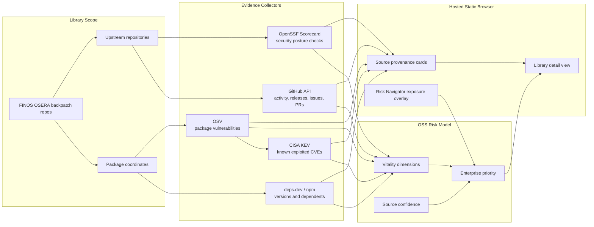

The OSS library-risk browser scores open source library health and enterprise
exposure side by side. It is seeded with FINOS OSERA `backpatch-*` repositories
as the initial library universe, with the `backpatch-` prefix removed and the
records scored against the upstream project where that upstream can be
identified.

## Hosted Browser

The browser is shipped as static website content:

```text
/oss-risk/browser.html
```

On GitHub Pages the full path is:

```text
https://finos-osera.github.io/risk-navigator/oss-risk/browser.html
```

On Netlify or an OSERA custom domain, the same static asset is served from
`/oss-risk/browser.html`. No additional hosting service or backend is required.

Individual records can be shared in two URL modes. Use
`?selected=<ecosystem>:<package>` to open the browser grid with the row
preselected, or `?p=<ecosystem>:<package>` to open the same record as a
project-focused full-detail page. For example,
`/oss-risk/browser.html?selected=maven:org.thymeleaf:thymeleaf` opens the
browser with Thymeleaf selected, while
`/oss-risk/browser.html?p=maven:org.thymeleaf:thymeleaf` opens Thymeleaf without
the aggregate grid.

## What It Shows

- OpenSSF Scorecard details, including a direct Scorecard viewer link and the
  lowest scoring checks.
- OSV package vulnerability summaries when the package ecosystem is supported.
- CISA Known Exploited Vulnerabilities matches derived from OSV CVE aliases.
- Repository, package registry, and CHAOSS-derived project-health evidence.
- FINOS OSERA backpatch fork provenance and upstream repository links.
- Enterprise exposure overlaid from selected Risk Navigator datasets.

The enterprise overlay is not random fixture data. The browser reads the same
Risk Navigator collection manifest as the main tool and joins records by package
coordinate. Maven coordinates are matched as `groupId:artifactId`; other
ecosystems are matched by their package name where supported by the dataset.

## Data Flow



## Vitality Dimensions

The OSS vitality score is a weighted blend of five terms:

| Dimension | Weight | Meaning | Primary sources |
|---|---:|---|---|
| Project vitality | 25% | Recent upstream motion: commits, releases/tags, recent pushes, issue activity, and contributor activity. | GitHub API |
| Security health | 25% | Security process and vulnerability posture: OpenSSF Scorecard security checks, OSV vulnerability records, and CISA KEV matches. | OpenSSF Scorecard, OSV, CISA KEV |
| Sustainability and governance | 20% | Maintainership and governance signals: contributor depth, review flow, licensing, security policy presence, CII best-practices signal, and issue/PR response indicators. | OpenSSF Scorecard, GitHub-derived CHAOSS-style metrics |
| Dependency hygiene | 15% | Package maintenance and dependency-management health: latest/default version, release age, deprecated versions, dependency update tooling, pinned dependencies, and vulnerability checks. | deps.dev, npm, OpenSSF Scorecard |
| Ecosystem resilience | 15% | Ecosystem importance and support capacity proxy: dependent counts, download signal where available, stars/forks, contributor base, and recent activity. | deps.dev, npm downloads, GitHub API |

Enterprise priority starts from the health gap and then factors in ecosystem
criticality, selected Risk Navigator enterprise exposure, deployed-version risk,
and source confidence.

Undermaintenance pressure is a derived watch signal. It compares downstream
demand, such as registry dependents, download signal where available, and
internal application usage, against visible maintainer capacity from active
maintainers and recent contributors. Higher values mean many consumers appear to
depend on a project relative to the observed maintainer/contributor base. The
browser shows the value in Scoring Notes; it is not a table column. The default
grid sort is OSS vitality ascending, so weaker upstream health appears first.

## Source Semantics

Each source card includes a source name, confidence, links, and source-specific
evidence. Neutral cards mean a source was not applicable to that package
coordinate, not that the collector failed.

OSV needs a concrete package ecosystem. For ordinary package managers that means
ecosystems such as `Maven`, `npm`, `PyPI`, `Go`, `NuGet`, `RubyGems`, or
`crates.io`. For system libraries, OSV needs a distro-specific ecosystem. For
example, OpenSSL can be queried as `Debian/openssl`, `Ubuntu/openssl`,
`AlmaLinux/openssl`, or `Rocky Linux/openssl`; generic `system/openssl` or
`rpm/openssl` is intentionally rendered as not applicable.

CISA KEV matching uses CVE aliases returned by OSV. If OSV is not applicable or
returns no CVE aliases, KEV either shows no matches or a disabled state. A KEV
match is a known-exploitation signal; deployed-version impact still depends on
the actual versions in the enterprise inventory.

## Updating The Data

The focused OSERA dataset is generated with:

```bash
npm run collect:oss-risk:finos-osera
```

The smaller example dataset is generated with:

```bash
npm run collect:oss-risk
```

The Docusaurus website build copies the browser and JSON datasets into
`website/static/oss-risk/` during `npm run docs:build`, so the hosted page is
kept in sync without changing `netlify.toml`.
