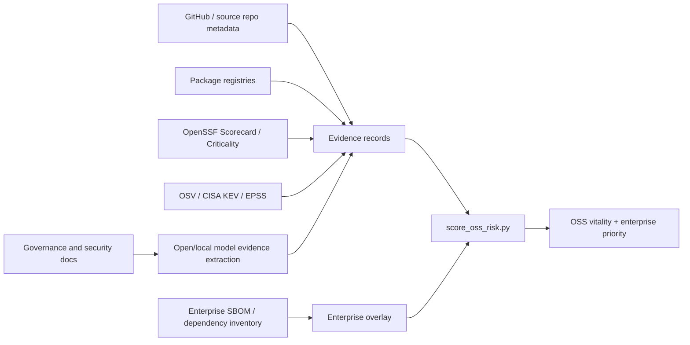

# OSS Library Risk

This folder defines a v0.1 OSS library risk scorecard for evaluating the open
source packages used inside an enterprise software estate.

The model deliberately separates three questions that are often collapsed into
one vague "risk" number:

1. Is the upstream OSS project healthy?
2. How important or fragile is that project in the wider ecosystem?
3. How much does this enterprise depend on the specific package versions it has
   deployed?

The output is therefore a scorecard, not a magic score. Every scored field keeps
its source family: OpenSSF, CHAOSS-style health metrics, OSV/CISA/security
feeds, package-registry metadata, GitHub/repository metadata, or the local
enterprise overlay.

## Folder Contents

- `model/scorecard-v0.1.md` defines the scoring dimensions, formulas, field
  normalization rules, and provenance expectations.
- `model/score_oss_risk.py` is a small reference scorer that turns scorecard
  records into explainable project and enterprise priority scores.
- `collectors/collect_oss_risk.py` pulls live public evidence from lightweight
  APIs and emits browser-compatible records.
- `SOURCES.md` explains which public collectors are used and when a full OSV
  download is appropriate.
- `PRIOR_ART.md` maps the model to CHAOSS, OpenSSF, Dependency-Track/SBOM
  practice, and underproduction research.
- `schema/oss-risk-record.schema.json` describes the expected scorecard record
  shape.
- `examples/library-scorecards.json` provides seed records for Log4j, Jackson,
  Spring Framework, Spring Boot, Requests, Lodash, and OpenSSL.
- `prompts/evidence-extraction.md` is a local/open-model prompt for converting
  gathered evidence into structured scorecard facts without asking the model to
  invent facts.

## Intended Workflow



Open models are useful here as evidence extractors and normalizers, not as the
source of truth. The scorer should only consume structured facts with source
URLs, timestamps, and confidence.

## Quick Run

```bash
python3 oss-risk/model/score_oss_risk.py \
  oss-risk/examples/library-scorecards.json
```

To browse the records visually:

```bash
npm run dev:oss-risk
```

The browser loads `oss-risk/examples/library-scorecards.json` by default and
also accepts another compatible JSON file through the `Load JSON` control.
When present, it prefers the FINOS OSERA-focused collected dataset at
`oss-risk/data/finos-osera-backpatch-scorecards.json`.

The `Enterprise overlay` selector uses the same Risk Navigator collections from
`tool/manifest.json`. It joins the selected collection's `libraries[]` rows to
OSS-risk records by package coordinates and derives applications, direct and
transitive exposure, deployed versions, and CVE-bearing versions from that
Risk Navigator dataset. This replaces fixture enterprise counts at display time;
the source scorecard JSON is not mutated.

## Pull Live Collector Data

The current examples are seed fixtures. To replace them with real public source
evidence for the bundled libraries:

```bash
npm run collect:oss-risk
```

This writes:

```text
oss-risk/data/collected-library-scorecards.json
```

Run the browser and load that JSON file, or keep it in place and the browser
will prefer it over the seed examples when served through Vite.

For a faster run without vulnerability lookups:

```bash
npm run collect:oss-risk:no-osv
```

To make the dataset focus on current FINOS OSERA backpatch libraries:

```bash
npm run collect:oss-risk:finos-osera
```

This discovers current `finos-osera/backpatch-*` repositories, strips the
`backpatch-` prefix for the displayed library name, resolves Maven coordinates,
uses the upstream fork parent where GitHub exposes one, and writes:

```text
oss-risk/data/finos-osera-backpatch-scorecards.json
```

The collector uses these public sources:

- OpenSSF Scorecard API for repository security checks.
- GitHub API for repository age, stars, forks, release activity, and commit
  windows.
- deps.dev API for package versions and public dependent counts where covered.
- npm downloads API for npm monthly download counts.
- OSV query API for package-level vulnerability records.
- CISA KEV JSON feed to flag OSV CVE aliases known to be exploited.

The collector does not need the full OSV archive for this scorecard workflow.
It queries the named packages directly. The existing Risk Navigator pipeline can
still download and ingest the full OSV archive when you need an offline/local
database for broad SBOM inventory analysis.

The example records are seed fixtures for developing the methodology. They are
not a current live assessment of those projects until the collectors are wired
to fresh source data.
